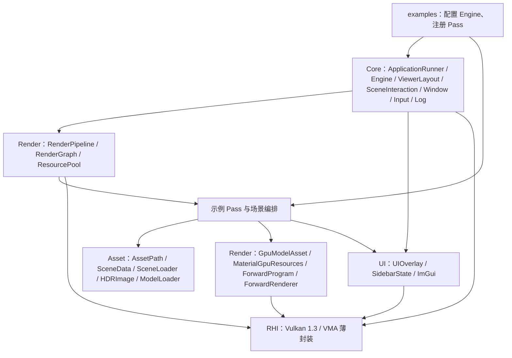

# 当前模块设计总览

核对日期：2026-10-07。以当前工作区源码为准；宏观能力与未来方向分别见 [架构现状](../structure/current-architecture.md) 和 [路线图](../structure/roadmap.md)。

## 模块关系

`ApplicationRunner` 是四个示例的共享启动入口，解析有限帧/resize/Validation 冒烟参数，构造 Engine 并在其销毁后归纳退出结果。Engine 是实际运行入口，统一执行 acquire、record、submit、present，并在每帧生成唯一的 `ViewerLayout` 快照。RenderPipeline 执行 Graph 编译结果，管理每个节点的 Dynamic Rendering Scope；Pass 记录业务命令。UIOverlay 唯一拥有右侧栏状态，RenderPipeline 只提供 Pass 内容和 Graph 内容；它们仍直接依赖 ImGui。

## 所有权与初始化信息

| 对象 | 所有者 | 传递方式 |
|---|---|---|
| Window、Instance、Surface、Device、SwapChain | Engine | 引用/原始句柄供运行时使用；Instance 还持有验证请求、可用性和消息计数状态 |
| ApplicationRunOptions、共享 ValidationMessageTracker | ApplicationRunner | 将命令行冒烟语义传给 Engine；Tracker 在 Instance/Messenger 销毁后仍可读取最终已捕获计数 |
| Pending / CompletedFrameStatistics | Engine 的 CompletedFrameStatisticsTracker | 一份提交在 Fence/deviceIdle 后从 pending 变为 completed，包含同一提交的 CPU、GPU、Draw 和 Vertices |
| CommandPool、CommandList、SyncManager | Engine | 在单帧同步边界内复用；Engine 不再拥有 RuntimeDepth |
| RenderPipeline、UIOverlay | Engine | Engine 驱动生命周期 |
| SidebarState / SidebarLayoutPolicy | UIOverlay | 单一右侧栏状态、区段和布局策略；帧快照供 Engine、输入与绘制共同使用 |
| ViewerLayout、SceneInteractionGate | Engine 帧数据 / 各交互 Pass | 前者按逻辑窗口和 framebuffer 映射场景矩形；后者仅保存拖动闩锁与输入 epoch |
| 各 RenderPass | RenderPipeline | `unique_ptr`；Graph 节点仅借用 Pass 指针 |
| Graph 逻辑资源和编译计划 | RenderGraph | typed Image/Buffer handle 含全局 generation；Pipeline 读取执行序、依赖和验证结果 |
| 内部 Image/Buffer allocation | RenderPipeline 的 RenderGraphResourcePool | pool 分配、缓存和销毁；candidate compile/resize 成功后才发布 |
| 外部 Image/View/Buffer | Engine 等调用方 | `bindExternalImage` / `bindExternalBuffer` 借用；Graph 不取得所有权 |
| SceneData 的 MeshAsset / SceneInstance | Asset::SceneLoader | 稳定整数 MeshHandle 连接实例和唯一 Mesh；候选完整校验成功后才发布 |
| GpuModelAsset、MaterialGpuResources、PBREnvironmentResources | MclarenPass / ForwardReusePass | 前者按 MeshHandle 上传一次；材质 variant 拥有五 sampler descriptor/纹理，环境拥有 lat-long HDR descriptor/纹理 |
| ForwardProgram、ForwardRenderer | 各使用者 Pass | Program 拥有固定 layout/shader/有限 pipeline cache；Renderer 拥有 frame/dynamic-draw UBO 与 descriptor pool，仅在 render 时借用资产 |
| RHIComputePipeline、RHIParameterSet | 使用它们的 callback/示例 Pass | 前者独立 RAII 管线；后者持有基础 descriptor 绑定并在创建/写入失败时回滚 |
| CallbackRenderPass、其 GraphCommandContext | RenderPipeline / 单次执行 | Pipeline 独占 callback；Context 只在 execute 期有效并检查声明的 handle/use/range |
| Mclaren 已发布/候选模型与环境 state、相机、GPU 装配 | MclarenPass | 模型 state 含 Scene、按 handle 的 GPU mesh、variant 和 draw；替换仅在单帧 Fence-safe update 发布 |

`RenderContext` 将设备引用、实际附件格式、初始尺寸、设备能力、深度比较方式和帧数传给 Pass。它没有承担帧资源所有权。

## 当前边界

- Runtime 只允许 `framesInFlight == 1`。
- Graph 已有 typed image/buffer descriptor、内部 allocation pool、checked handle/use/range resolve、candidate resize、synchronization2、Compute callback、受约束 native scope，以及 Graph-owned Forward SceneColor/Depth → Display → Overlay → Present 输出；内部 allocation 可缓存但内容逐帧失效。资源别名、多 Queue 尚未实现；系统不能自动检测任意裸 Vulkan 命令。
- RHI 中实际类为 `RHITexture`，持有 Image/View/VMA allocation；Sampler 由上层持有。没有独立 RHIImage 或公共 Descriptor Builder。
- AssetPath 统一规范资源根下相对路径并生成去重键；SceneLoader 以候选 SceneData 加载、验证并发布。HDRImage 是严格校验尺寸、元素溢出和 HDR 像素的纯 CPU 资产，不持有 Vulkan 资源。
- `ForwardProgram` / `ForwardRenderer` 是 Mclaren 与 ForwardReuse 的公共绘制路径；Mclaren 不再合并公共主 mesh 或使用旧 renderer 主路径。树中旧 `MclarenRenderResources`/shader 文件未构建、未运行。
- MaterialData 显式表达 PBR/Unlit、Opaque/Mask/Blend/cutoff/doubleSided、五个独立纹理和各自 UV；Scene 实例持有 TRS、material reference 和可选 override。材质 variant 只按 descriptor 资源差异去重，scalar/UV 在 draw UBO。
- Mclaren Sidebar/CLI 对模型/HDR 仅排队不可变请求；当前单帧 Runtime 在 Fence 已完成、acquire 后、录制前同步构建候选。成功原子交换已发布 state，失败保留活跃路径、generation、相机和统计；没有异步加载、watcher、缓存或多帧 retire。
- Mclaren 相机提供 OrbitInspect / FreeFly 两种模式和统一 `CameraFrame`，`CameraInputSample` 仅将 Runtime Input/ImGui 状态适配到示例控制器；Cube 保持原有拖动控制，尚未接入 FreeFly。`OrbitCameraController` 的历史文件名在双模式后仍保留，是当前示例层技术债。
- Draw Call/顶点统计由 CommandList 的饱和累加器记录；CPU、GPU、Draw、Vertices 通过 completed-submit 快照同时发布。FPS/Frame 保持当前主循环样本。右侧栏展开时保留场景区域，收起后以紧凑统计或仅重开控件覆盖在场景上；参数内容由 Pass 提供并按 Pass 索引隔离 ImGui ID。Debug 构建中，Instance 会在可用时将 Vulkan Validation/Debug Utils 消息写入日志并累计警告、错误数；ApplicationRunner 会在 Runtime 销毁后将已捕获的 Validation error 映射为失败退出码，有限帧参数只决定自动化运行范围。
- 当前构建使用 C++20、CMake、vcpkg、Vulkan、GLFW、ImGui、GLM、spdlog/fmt、JSON、tinygltf/stb 和 GoogleTest；没有实现 C++ Modules、完整 FrameGraph 或自动实验系统。Graph-owned Forward SceneColor/Depth/display 已在 M3 实现；Deferred/full IBL/OIT/线性 HDR 统一输出是 M4；异步缓存/多帧 retire 是 M5。

## 架构图片

原架构 PNG 已保留在 [历史架构图片](../structure/archive/kuengine-architecture.png)。其中“Engine::render 是占位”和“示例持有深度”的文字对应迁移前状态；当前模块关系以上方 Mermaid 和专项设计为准。
