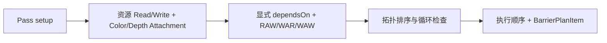

# RenderPass、RenderGraph 与执行器设计

核对日期：2026-10-07。

源码：[RenderPass](../../src/KuEngine/Render/RenderPass.h)、[RenderContext](../../src/KuEngine/Render/RenderContext.h)、[RenderGraph](../../src/KuEngine/Render/RenderGraph.h)、[RenderPipeline](../../src/KuEngine/Render/RenderPipeline.cpp)。

## 生命周期

RenderPipeline 通过 unique_ptr 持有 Pass。compile(context) 初始化 Pass、注册 Graph 节点、调用 setup(builder)，然后编译依赖与执行顺序。

| 接口 | 当前职责 |
|---|---|
| name() | 节点名称 |
| initialize(const RenderContext&) | 按实际格式和设备能力创建资源 |
| setup(RenderGraphBuilder&) | 声明资源、附件和依赖 |
| update(const FrameData&) | 更新每帧业务数据 |
| execute(CommandList&, const FrameData&) | 记录业务命令 |
| drawUI() | 仅构建该 Pass 的参数内容；不创建独立顶层窗口 |
| onResize(width, height) | 更新尺寸相关数据 |
| enabled() / setEnabled() | 控制 update/execute 是否运行 |

兼容的无参 setup() 仍存在，默认 builder 版本会调用它。没有 shutdown() 接口，清理由析构完成。Pass enabled 改变不会重新编译 Graph；附件的内容依赖仍需满足执行约束。

Mclaren 的资产替换请求由 UI/CLI 入队，实际候选构建和发布发生在其 `update()`。Engine 调用 update 前已经等待当前单帧 Fence、完成 acquire，且尚未开始命令录制；因此当前 `framesInFlight == 1` 下这是可销毁旧 GPU 资产并交换新 state 的安全点。resize 跳过帧不会调用 update，待处理请求保留至下一正常帧；该机制不增加常态 `deviceWaitIdle`，也不适用于多帧并行的 retire 策略。Mclaren 与 ForwardReuse 的业务绘制均通过公共 `ForwardRenderer`，写入 Graph 创建的 SceneColor/SceneDepth；Display 才以 SwapChainColor 为外部附件。

## 初始化契约

RenderContext 包括 RHIDevice 引用、colorFormat、depthFormat、initialExtent、framesInFlight、depthCompareOp，以及设备属性/特性引用。hasDepth() 根据最终深度格式判断可用性。

运行时外部资源名称集中在 runtime_resource：SwapChainColor。示例只引用逻辑名，实际交换链图像由 Engine 每帧绑定；ForwardSceneColor/ForwardSceneDepth 是 Graph internal targets。

## 声明与编译

资源以 typed `ImageHandle`/`BufferHandle` 声明，包含 index、global graph generation 和 kind。create/import 记录完整 ImageDesc/BufferDesc；同名必须有相同 kind、ownership 和 descriptor。RenderPipeline 在 compile 后通过资源池分配 internal Image/Buffer，external 始终借用；具体 descriptor、pool、resize 与 export 生命周期见 [Graph 资源](12-graph-resources.md)。

colorAttachment/depthAttachment 隐式声明写使用。PassAttachment 保存 Color/Depth 类型和 Load/Store 策略：
- Load：RuntimeDefault、Load、Clear、DontCare；
- Store：RuntimeDefault、Store、DontCare。

资源冲突按 Pass 注册顺序建立方向，再与显式依赖共同拓扑排序。因此注册顺序仍影响资源版本的推断，不能把该 Graph 理解为与注册顺序完全无关的调度器。

## 外部绑定与执行

ExternalImageBindingInfo 提供 Image、ImageView、Extent、当前/最终 Layout、Aspect、清除值、默认 Load/Store 和 contentsValid。

每个节点执行时，RenderPipeline 先发出屏障并对齐布局；有附件的节点校验绑定、类型和尺寸，解析 Load/Store，开启独立 Dynamic Rendering Scope。Scope 的 `renderArea` 始终覆盖完整附件；业务 Pass 的 viewport/scissor 使用 `FrameData::viewerLayout.sceneFramebuffer`，因此展开侧栏只缩小场景绘制区域，UI Overlay 仍能覆盖完整交换链。没有附件的节点可执行普通 Pass 或 Pipeline 拥有的 `CallbackRenderPass`。

Load 请求要求此前 contentsValid；Store=STORE 才保留可供后续使用的内容。缺失外部绑定、非法附件或无效 Load 会报错。

Alpha3Pass 的首节点使用 Runtime 清屏默认值，后两节点 LOAD 之前结果。Mclaren 在一个 Graph Pass/Scope 内先画 Skybox 再画 PBR，尚未拆成两个 Graph 节点。

## UI 与最终状态

业务节点结束后，Engine 调用 executeOverlay 创建独立 UI Scope。该方法处理附件布局、Load/Store 和内容状态，以完整附件 renderArea 绘制唯一的 UIOverlay。参数 UI 和 Graph UI 已通过 UIOverlay 的右侧栏收容；RenderPipeline 分别提供内容回调，并以 Pass 索引 `PushID` 隔离同名控件。UI 暂未注册成普通 Graph Pass。

finalizeExternalImages 收束外部图像到 finalLayout，供 Engine 提交和呈现。

## 当前约束

Graph 已管理真实 internal Image/Buffer allocation 和 synchronization2 image/buffer barrier；纯 CPU planner 在 disabled mask 后验证 RAW/WAR/WAW、range、writer epoch 与 first-use，并输出批量 barrier。RenderPipeline 仅在成功录制后提交 execution state/content shadow。`CallbackRenderPass` 经过 declare/prepare/execute：参数只读、recompile 使 handle 失效、只稳定借用 RHIDevice；其 `GraphCommandContext` 仅解析已声明 handle/use/range，并记录 fill/copy、Compute pipeline/parameter binding/dispatch。受约束 native scope 必须声明已知 capability/side-effect 与 use 子集，执行期外失效；unknown flag 在构造时拒绝，attachment scope 禁止 Compute/Transfer。Forward 已将 SceneColor/Depth 作为 Graph internal targets，并经 Display sampled→SwapChain→Overlay→Present；资源别名、多 Queue 仍未实现。旧对象只能标为 `TrustedLegacyObject`，不能自动识别任意裸 Vulkan 命令。RenderPipeline 同时负责 candidate compile/resize、internal pool、external binding、执行和 ImGui Graph Debug 面板。

当前 CPU 测试覆盖逻辑依赖、循环/缺失依赖、Hazard、附件声明等；不是完整 GPU 执行回归。测试入口：[test_render_graph.cpp](../../tests/core/test_render_graph.cpp)。
