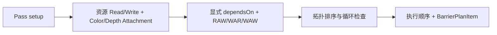

# RenderPass、RenderGraph 与执行器设计

核对日期：2026-09-12。

源码：[RenderPass](../../src/KuEngine/Render/RenderPass.h)、[RenderContext](../../src/KuEngine/Render/RenderContext.h)、[RenderGraph](../../src/KuEngine/Render/RenderGraph.h)、[RenderPipeline](../../src/KuEngine/Render/RenderPipeline.cpp)。

## 生命周期

RenderPipeline 通过 unique_ptr 持有 Pass。compile(context) 初始化 Pass、注册 Graph 节点、调用 setup(builder)，然后编译依赖与执行顺序。

| 接口 | 当前职责 |
|---|---|
| name() | 节点名称 |
| initialize(const RenderContext&) | 按实际格式和设备能力创建资源 |
| setup(RenderGraphBuilder&) | 声明资源、附件和依赖 |
| update(const FrameData&) | 更新每帧业务数据 |
| execute(CommandList&, const FrameData&) | 记录业务命令 |
| drawUI() / drawUIInline() | 独立面板或嵌入控制面板 |
| onResize(width, height) | 更新尺寸相关数据 |
| enabled() / setEnabled() | 控制 update/execute 是否运行 |

兼容的无参 setup() 仍存在，默认 builder 版本会调用它。没有 shutdown() 接口，清理由析构完成。Pass enabled 改变不会重新编译 Graph；附件的内容依赖仍需满足执行约束。

## 初始化契约

RenderContext 包括 RHIDevice 引用、colorFormat、depthFormat、initialExtent、framesInFlight、depthCompareOp，以及设备属性/特性引用。hasDepth() 根据最终深度格式判断可用性。

运行时资源名称集中在 runtime_resource：SwapChainColor 和 SceneDepth。示例只引用逻辑名，实际图像由 Engine 每帧绑定。

## 声明与编译

ResourceDesc 目前只有 name 和 external。createResource 创建逻辑记录；importExternal 导入逻辑名称。它们都不会分配 Vulkan Image/Buffer。

colorAttachment/depthAttachment 隐式声明写使用。PassAttachment 保存 Color/Depth 类型和 Load/Store 策略：
- Load：RuntimeDefault、Load、Clear、DontCare；
- Store：RuntimeDefault、Store、DontCare。

资源冲突按 Pass 注册顺序建立方向，再与显式依赖共同拓扑排序。因此注册顺序仍影响资源版本的推断，不能把该 Graph 理解为与注册顺序完全无关的调度器。

## 外部绑定与执行

ExternalImageBindingInfo 提供 Image、ImageView、Extent、当前/最终 Layout、Aspect、清除值、默认 Load/Store 和 contentsValid。

每个节点执行时，RenderPipeline 先发出屏障并对齐布局；有附件的节点校验绑定、类型和尺寸，解析 Load/Store，开启独立 Dynamic Rendering Scope，设置默认 viewport/scissor，再调用 Pass::execute 并结束 Scope。没有附件的节点直接执行回调。

Load 请求要求此前 contentsValid；Store=STORE 才保留可供后续使用的内容。缺失外部绑定、非法附件或无效 Load 会报错。

Alpha3Pass 的首节点使用 Runtime 清屏默认值，后两节点 LOAD 之前结果。Mclaren 在一个 Graph Pass/Scope 内先画 Skybox 再画 PBR，尚未拆成两个 Graph 节点。

## UI 与最终状态

业务节点结束后，Engine 调用 executeOverlay 创建独立 UI Scope。该方法处理附件布局、Load/Store 和内容状态，然后调用 UIOverlay。UI 暂未注册成普通 Graph Pass。

finalizeExternalImages 收束外部图像到 finalLayout，供 Engine 提交和呈现。

## 当前约束

Graph 不管理真实内部资源、Buffer Barrier、资源别名、子资源范围、多 Queue 或异步 Compute；屏障规划偏保守，没有最小化保证。RenderPipeline 同时负责执行、外部绑定和 ImGui Graph Debug 面板。其执行摘要包含计划/已应用屏障、资源转换、Scope 和跳过计数。

当前 CPU 测试覆盖逻辑依赖、循环/缺失依赖、Hazard、附件声明等；不是完整 GPU 执行回归。测试入口：[test_render_graph.cpp](../../tests/core/test_render_graph.cpp)。
