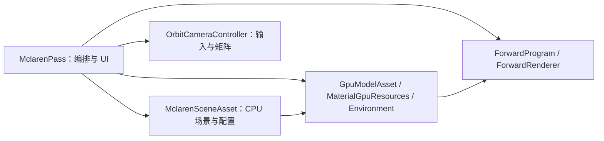

# 示例模块设计

核对日期：2026-10-07。保留原 Triangle 文档路径，现在统一说明六个示例的当前装配。

## 公共入口

六个 main 都创建 `EngineConfig`，再交给 `runApplication()` 统一解析参数、创建 Engine、注册 Pass、compile/run 和归纳退出码。Vulkan 帧循环、交换链、同步、深度和 UI Backend 由 Engine 持有。

| 示例 | Pass/组件 | 当前绘制 |
|---|---|---|
| [Triangle](../../examples/triangle/TrianglePass.cpp) | TrianglePass | Shader 生成 3 顶点，颜色经 fragment Push Constant 传入 |
| [Cube](../../examples/cube/CubePass.cpp) | CubePass | Shader 生成实心 36 顶点或线框 24 顶点；两套 Pipeline |
| [Alpha3Pass](../../examples/alpha3pass/AlphaPasses.cpp) | 三个 AlphaShapePass | 每个 3 顶点，显式依赖链，共享颜色附件 |
| [Mclaren](../../examples/mclaren/MclarenPass.cpp) | MclarenPass 及替换/相机组件 | 公共 Forward 在同一 Scope 画 Skybox 与实例 SubMesh draw |
| [ForwardReuse](../../examples/forward_reuse/ForwardReusePass.cpp) | ForwardReusePass | 公共 Forward 的 semantic-card 复用与回归示例，固定 8 draw / 42 vertices |
| [GraphResourceProbe](../../examples/graph_resource_probe/GraphResourceProbePass.cpp) | GraphResourceProbePass | 六 Pass Graph：ImageClear、BufferFill、native Copy callback、normal Compute callback、SampleDraw、PostDrawCopy；固定 1 draw / 3 vertices |

Mclaren 与 ForwardReuse 均在 Forward Pass 后显式加入 `ForwardDisplayPass`：业务统计相应为 Mclaren 91 draw / 9,202,884 vertices、ForwardReuse 9 draw / 45 vertices；其他示例不变。

四个示例共享以下非交互冒烟参数：`--smoke-frames N` 按成功提交的帧数停止（`0` 保持无限交互循环）；`--smoke-require-validation` 要求可捕获 Validation 消息；`--smoke-resize-after FRAME WIDTH HEIGHT` 在指定提交帧后请求窗口 resize，且帧上限至少比该帧多两帧；`--smoke-sidebar-collapsed` 从紧凑侧栏启动并核对布局；`--smoke-inject-validation-error` 仅用于受控负例，必须同时要求 Validation 与正帧数。普通不带参数的运行方式不变。

每个 Pass 可选提供 `expectedFrameStatistics()`；RenderPipeline 只在所有启用 Pass 都提供预期值时汇总。有限帧 Runner 将最后一个 completed submit 的业务计数同预期值比较，并输出 `KUENGINE_COMPLETED_STATS ... status=matched`；不匹配、没有完成快照或没有完整预期值均为 smoke fail。Triangle 固定 1/3，Cube 为 1/36（默认实心），三 Alpha Pass 为 3/9；Mclaren 为“启用 Skybox 时 1 个 3 顶点 draw，加每个 `indexCount>0` SubMesh 的一个 indexed draw 和其 indexCount”，因此只做正数/匹配检查而非固定常数。

## Triangle 与 Cube

TrianglePass 从当前运行目录 shaders 读取 SPIR-V，以 RenderContext 的颜色格式创建 Pipeline。不使用 Vertex Buffer 或深度；Draw Call=1，提交顶点=3。

Cube 的 MVP、颜色和模式通过 Push Constants 传给 Shader；左键仅在场景逻辑矩形内开始拖动，视口内滚轮缩放，UI 捕获、侧栏和失焦不改变相机。投影比例来自共享 `ViewerLayout`。UI 切换实心/线框、距离和颜色。当前也不启用 Runtime 深度。两种模式都是一次 draw。

## Alpha3Pass

Background → MainTriangle → Accent 通过 dependsOn 声明顺序，并共同写 SwapChainColor。首节点使用 RuntimeDefault Load，后续节点使用 LOAD，Store=STORE 保留颜色；每个节点有独立 Rendering Scope。各节点 UI 调整颜色、位置与缩放。

启用全部节点且 Pipeline 就绪时，业务 draw 数为 3、提交顶点为 9。该示例不创建离屏中间图像。

## Mclaren 与 ForwardReuse 组件关系

- SceneAsset 读取场景、默认/fit/label 适配并保存相机、光照、模型中心和 fitScale；公共 Forward 按实例/handle 构建 GPU mesh、材质 variant 和 draw，GPU 上传后 releaseCpuMesh 释放 CPU Mesh。
- `OrbitCameraController` 仍是 Mclaren 的示例层控制器（历史文件名未改），提供 `ViewerCameraMode::OrbitInspect` / `FreeFly` 和供渲染统一消费的 `CameraFrame`；`CameraInputSample` 仅适配 `ViewerLayout`、Runtime Input 与 ImGui 捕获状态。比例取自共享 `ViewerLayout`，不再维护第二套局部视口。
- Pass 拥有 ForwardProgram/ForwardRenderer；模型/材质/环境 state 分别持有长期资产。Pass 声明 SwapChainColor 和可选 SceneDepth；update 构造 `CameraInputSample`，execute 使用 Pipeline 已设置的场景 viewport/scissor、统一 `CameraFrame` 与逐 draw 数据，画 Skybox/PBR。
- ready 为 false、视口无宽度或数据更新失败时提前退出，统计只累加实际经过 CommandList 的绘制。

Mclaren main 设置 enableDepth=true；Depth Image 和 resize 生命周期均属于 Engine。Model/HDR 的 Sidebar 和专用 CLI 请求在正常 Pass update 的单帧 Fence-safe 点处理：模型候选重建场景、fit、公共 GPU 资产、Pipeline/帧容量与预期统计，环境候选只重建 HDR/环境资源；成功才发布，失败保留当前画面、相机与统计。更多 GPU 绑定细节见 [PBR 设计](10-pbr-rendering.md)。

### Mclaren 查看器相机

OrbitInspect 保留既有语义：左键必须从场景区域开始拖动，改变模型 yaw/pitch；场景滚轮改变观察距离。FreeFly 以右键从场景区域开始获得输入焦点并转向，焦点存在时 `W/S/A/D` 前后左右、`Q/E` 下上移动；移动向量归一化、按 `deltaTime` 缩放，yaw 环绕、pitch 限制在接近 ±89°。右侧栏、文本输入、键盘/鼠标捕获、失焦、布局失效或 interaction epoch 改变都会取消焦点并要求输入先回到中性，防止跨恢复/切换的按键或鼠标残留。

模式切换使用当前 `CameraFrame` 双向交接：进入 FreeFly 从 Orbit 视图位置/朝向播种，返回 Orbit 从 FreeFly 位置/朝向重建目标；切换后先要求中性输入。`Reset View` 以场景配置恢复当前模式的视图，`Reset Model Rotation` 只清 Orbit 模型旋转。该控制器尚未是公共相机 API，Cube 也没有 FreeFly。

`ForwardReuseApp` 读取 data-URI fixture，不依赖外部 HDR，验证共享 MeshHandle 的两个实例、两种 descriptor variant 和 PBR/Unlit、MR/AO/emissive、alpha/double-sided 分派。它的受控预设/抓帧检查不是像素 readback 或鼠标 UI 自动化。

## 当前约束与验证入口

旧 MclarenRenderResources 仍可能作为未构建遗留文件存在，不是当前主干。CameraController 可以独立做 CPU 测试，其他示例绘制仍需 GPU 冒烟验证。当前没有通用 Scene/ECS 或编辑器。

运行和回归操作见 [usage](../usage/README.md)，此处仅描述模块设计。
