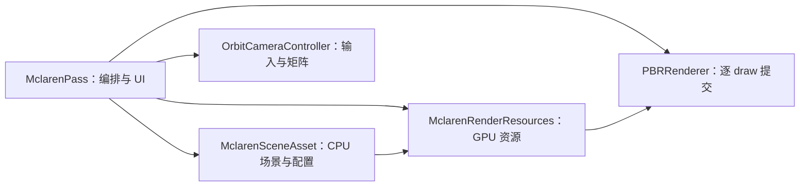

# 示例模块设计

核对日期：2026-09-13。保留原 Triangle 文档路径，现在统一说明四个示例的当前装配。

## 公共入口

四个 main 都创建 `EngineConfig`，再交给 `runApplication()` 统一解析参数、创建 Engine、注册 Pass、compile/run 和归纳退出码。Vulkan 帧循环、交换链、同步、深度和 UI Backend 由 Engine 持有。

| 示例 | Pass/组件 | 当前绘制 |
|---|---|---|
| [Triangle](../../examples/triangle/TrianglePass.cpp) | TrianglePass | Shader 生成 3 顶点，颜色经 fragment Push Constant 传入 |
| [Cube](../../examples/cube/CubePass.cpp) | CubePass | Shader 生成实心 36 顶点或线框 24 顶点；两套 Pipeline |
| [Alpha3Pass](../../examples/alpha3pass/AlphaPasses.cpp) | 三个 AlphaShapePass | 每个 3 顶点，显式依赖链，共享颜色附件 |
| [Mclaren](../../examples/mclaren/MclarenPass.cpp) | MclarenPass 及三个辅助组件 | 同一 Scope 中先画 Skybox，再逐 SubMesh indexed draw |

四个示例共享以下非交互冒烟参数：`--smoke-frames N` 按成功提交的帧数停止（`0` 保持无限交互循环）；`--smoke-require-validation` 要求可捕获 Validation 消息；`--smoke-resize-after FRAME WIDTH HEIGHT` 在指定提交帧后请求窗口 resize，且帧上限至少比该帧多两帧；`--smoke-inject-validation-error` 仅用于受控负例，必须同时要求 Validation 与正帧数。普通不带参数的运行方式不变。

## Triangle 与 Cube

TrianglePass 从当前运行目录 shaders 读取 SPIR-V，以 RenderContext 的颜色格式创建 Pipeline。不使用 Vertex Buffer 或深度；Draw Call=1，提交顶点=3。

Cube 的 MVP、颜色和模式通过 Push Constants 传给 Shader；左键拖动更新旋转，UI 切换实心/线框、距离和颜色。当前也不启用 Runtime 深度。两种模式都是一次 draw。

## Alpha3Pass

Background → MainTriangle → Accent 通过 dependsOn 声明顺序，并共同写 SwapChainColor。首节点使用 RuntimeDefault Load，后续节点使用 LOAD，Store=STORE 保留颜色；每个节点有独立 Rendering Scope。各节点 UI 调整颜色、位置与缩放。

启用全部节点且 Pipeline 就绪时，业务 draw 数为 3、提交顶点为 9。该示例不创建离屏中间图像。

## Mclaren 组件关系

- SceneAsset 读取场景中的多个模型并合并 Mesh，材质 JSON 只使用首个有效引用；保存相机、光照、模型中心和 fitScale。GPU 上传后 releaseCpuMesh 释放 CPU Mesh。
- CameraController 消费 Input 和 ImGuiIO 鼠标/滚轮信息，管理旋转、缩放、投影及局部视口。
- RenderResources 拥有 Shader/Pipeline、GpuMesh、Texture、Descriptor/Sampler、动态 UBO、上传器及 PBRRenderer。
- Pass 声明 SwapChainColor 和可选 SceneDepth；update 更新输入，execute 设置局部 viewport/scissor、计算相机与逐 draw 数据、画 Skybox/PBR。
- ready 为 false、视口无宽度或数据更新失败时提前退出，统计只累加实际经过 CommandList 的绘制。

Mclaren main 设置 enableDepth=true；Depth Image 和 resize 生命周期均属于 Engine。更多 GPU 绑定细节见 [PBR 设计](10-pbr-rendering.md)。

## 当前约束与验证入口

MclarenRenderResources 仍是较大的示例专属容器；CameraController 可以独立做 CPU 测试，其他示例绘制仍需 GPU 冒烟验证。当前没有通用 Scene/ECS 或编辑器。

运行和回归操作见 [usage](../usage/README.md)，此处仅描述模块设计。
