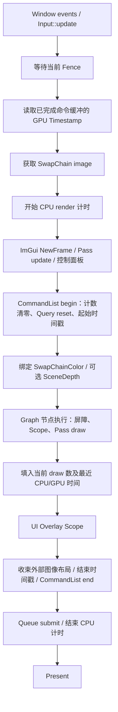

# Core 与公共 Runtime 设计

核对日期：2026-09-12。

源码：[Engine.h](../../src/KuEngine/Core/Engine.h)、[Engine.cpp](../../src/KuEngine/Core/Engine.cpp)、[Window](../../src/KuEngine/Core/Window.h)、[Input](../../src/KuEngine/Core/Input.h)。

## 职责与配置

Engine 聚合窗口、Vulkan 对象、渲染管线和 UI，负责创建、运行、交换链重建与销毁。四个示例均通过 `Engine::addPass<T>()`、`compile()`、`run()` 接入。

| EngineConfig 字段 | 当前含义 |
|---|---|
| title / width / height | 窗口配置；默认 1280 × 720 |
| framesInFlight | 默认且只允许 1 |
| showStats | 控制统计面板显示 |
| enableDepth | 是否创建 Runtime 深度附件，默认 false |
| depthFormat | 启用深度时，UNDEFINED 表示自动选择支持的格式 |
| clearColor / clearDepthStencil | 附件清除值 |
| depthLoadOp / depthStoreOp | 默认 CLEAR / DONT_CARE |
| depthCompareOp | 默认 LESS，传入 RenderContext |

是否启用深度由 enableDepth 决定，不能仅通过 depthFormat 是否为 UNDEFINED 判断。

## 一帧时序

FrameData 携带 frameIndex、imageIndex、deltaTime、totalTime。frameIndex 是同步槽索引，单帧配置下一直为 0；imageIndex 才是获取到的交换链图像索引。

## 深度、布局与 resize

Engine 持有深度 RHITexture，尺寸跟随 SwapChain；初次创建不执行独立上传命令，首次布局转换由 Graph 完成。默认不保留深度内容；配置 LOAD 必须同时设置 STORE，否则构造时拒绝。请求 LOAD 但内容尚未初始化时，Runtime 将其转为 CLEAR。

Engine 记录每个交换链图像的布局，并按名称绑定实际 Image、View、Extent、Aspect、Layout、Load/Store、Clear 和最终布局。Present 前颜色图像转换到 PRESENT_SRC_KHR。

尺寸变化或交换链过期时，Engine 等待设备空闲、重建交换链与深度、清除外部绑定和通知 Pass::onResize。最小化时暂缓绘制，主循环短暂休眠。

退出时先等待 GPU，再销毁 Pass、UI 和图像/命令/同步/交换链及命令池，之后依次销毁 Device、Surface、Instance 和 Window，保证依赖对象仍存活。

## Window 与 Input

Window 封装 GLFW 初始化、窗口、事件、framebuffer resize 与关闭回调；通过窗口计数控制 GLFW 初始化/终止。Input 保存全局静态按键/鼠标状态，支持 down、pressed、鼠标位置和位移；它没有滚轮查询接口，Mclaren 的滚轮值取自 ImGuiIO。

## 计时与约束

CPU 使用 Engine::Clock（当前为 high_resolution_clock）测量 acquire 成功后至 submit 返回的墙钟时间，包括 Pass 更新、UI 和命令记录；不包括事件轮询、Fence/acquire 等待与 present。详细显示语义见 [UI 与统计](05-ui-layer.md)。

Runtime 的单帧限制是命令、动态 UBO、深度和 QueryPool 复用的前提。当前没有独立场景管理器、固定时间步模拟或多窗口运行调度。
