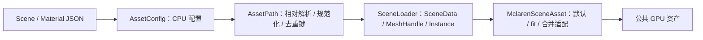

# 资源目录与资产配置设计

核对日期：2026-09-16。

源码：[AssetPath](../../src/KuEngine/Asset/AssetPath.h)、[Scene](../../src/KuEngine/Asset/Scene.h)、[HDRImage](../../src/KuEngine/Asset/HDRImage.h)、[AssetConfig](../../src/KuEngine/Asset/AssetConfig.h)、[MclarenSceneAsset](../../examples/mclaren/MclarenSceneAsset.cpp)。

## 已有资源布局

| 实际路径 | 用途 |
|---|---|
| resources/models/props/mclaren_765lt.glb | 示例模型 |
| resources/scenes/sandbox/mclaren-sandbox.scene.json | 场景入口 |
| resources/materials/pbr/mclaren-765lt.material.json | 全局材质覆盖 |
| resources/environments/hdr/citrus_orchard_road_puresky_4k.hdr | 示例环境 |
| resources/manifests/asset-registry.json | 资产登记信息 |
| resources/shaders/common/lighting.glsl | 公共 GLSL 光照片段 |
| examples/*/shaders | 各示例 Shader |

部分目录保留分类占位，但目录存在不等于运行时支持相应格式。当前模型仍直接放在 props 下，没有强制实现旧文档提出的“每个模型一个 runtime/meta 包”结构。

CMake 将示例所需资源复制到可执行程序旁 resources。实际加载先查运行目录，再按 KUENGINE_SOURCE_DIR 回退源码目录。资产清单虽被复制，目前没有统一 Registry 加载器/缓存，也不通过清单自动发现模型。

## SceneConfig

| 结构 | 当前解析字段 |
|---|---|
| SceneCameraConfig | position、target、up、fovYDeg、near、far |
| SceneLightingConfig | direction、color、intensity |
| SceneNodeConfig | id、model、material、TRS、可选 materialOverride |
| SceneConfig | camera、lighting、nodes，以及可选 environment |

loadSceneConfigFromFile 返回 bool，可传 errorMessage；缺字段使用结构默认值。`environment` 是向后兼容的可选字段。findResourcesRoot 为模型、材质和环境相对路径解析定位 resources 根。

`SceneLoader` 从 SceneConfig 构建公共 `SceneData`：`MeshAsset` 以稳定整数 `MeshHandle` 保存唯一模型，`SceneInstance` 引用 Handle 并保存 material reference、显式 override 和 TRS。AssetPath 将资源根下相对引用解析、规范化并以路径键去重；所有模型加载与 handle 图校验通过后才替换输出 SceneData，失败不发布半成品。TRS 为 `T * Rz * Ry * Rx * S`，数值必须有限且 scale 为正；fit 将 local AABB 变换后合并。MclarenSceneAsset 保留默认回退、fit/label 和旧合并适配职责，但当前 Mclaren 公共 Forward 主路径使用实例记录，而非合并 GPU mesh。

## MaterialConfig

当前解析 id/version/pipeline、alphaMode、doubleSided、alphaCutoff、baseColorFactor、metallicFactor、roughnessFactor、normalScale、occlusionStrength。

textureBindings 包含 baseColor、normal、metallicRoughness、occlusion、emissive 和 legacy orm；各绑定有 source、colorSpace、channelMapping、uvSet 和相应 has* 标记，用于区分“未指定”和“显式覆盖”。配置经公共 Forward 材质解析转换为实际 binding。

各语义均可有 source/colorSpace/channelMapping/UV binding：base、normal、metallicRoughness、occlusion、emissive；legacy `ormBinding` 仅在显式 MR/AO 都不存在时映射到两者。source 当前用于选择 glTF 内置纹理或禁用；不提供任意外部纹理路径加载。channelMapping 是 descriptor-variant 键的一部分，但不代表任意通道重打包。

## 解析与 GPU 的边界

AssetConfig、AssetPath、SceneLoader 和 HDRImage 都不创建 Vulkan 对象。HDRImageLoader 只接受可验证的 HDR 解码结果，检查宽高、RGBA float 元素数和溢出后才发布像素。找不到 Scene 时示例回退默认模型/相机/光照；材质配置失败时回退 glTF/default。完全没有成功加载模型或环境 HDR 时返回失败并显示错误。

Mclaren 替换入口接受相对于已解析 resources root 的路径或绝对路径；模型仅接受 `.gltf`/`.glb`，环境仅接受 `.hdr`，且必须存在并是普通文件。UI/CLI 只排队请求；路径、解码或兼容性失败会保留当前已发布资产，不产生半成品状态。当前没有文件选择器、文件监听器、异步加载或跨场景缓存。

## 当前约束

资源命名和元数据依赖人工维护，没有自动 schema 校验、压缩纹理导入、异步加载、资产 Registry 或缓存。Mesh 路径在单次 SceneData 加载内去重，但没有跨场景缓存。Mclaren 的同步替换已实现；更完整通用导入入口尚未实现。
