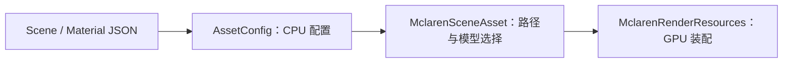

# 资源目录与资产配置设计

核对日期：2026-09-12。

源码：[AssetConfig.h](../../src/KuEngine/Asset/AssetConfig.h)、[AssetConfig.cpp](../../src/KuEngine/Asset/AssetConfig.cpp)、[MclarenSceneAsset](../../examples/mclaren/MclarenSceneAsset.cpp)。

## 已有资源布局

| 实际路径 | 用途 |
|---|---|
| resources/models/props/mclaren_765lt.glb | 示例模型 |
| resources/scenes/sandbox/mclaren-sandbox.scene.json | 场景入口 |
| resources/materials/pbr/mclaren-765lt.material.json | 全局材质覆盖 |
| resources/environments/hdr/citrus_orchard_road_puresky_4k.hdr | 示例环境 |
| resources/manifests/asset-registry.json | 资产登记信息 |
| resources/shaders/common/lighting.glsl | 公共 GLSL 光照片段 |
| examples/*/shaders | 各示例 Shader |

部分目录保留分类占位，但目录存在不等于运行时支持相应格式。当前模型仍直接放在 props 下，没有强制实现旧文档提出的“每个模型一个 runtime/meta 包”结构。

CMake 将示例所需资源复制到可执行程序旁 resources。实际加载先查运行目录，再按 KUENGINE_SOURCE_DIR 回退源码目录。资产清单虽被复制，目前没有统一 Registry 加载器/缓存，也不通过清单自动发现模型。

## SceneConfig

| 结构 | 当前解析字段 |
|---|---|
| SceneCameraConfig | position、target、up、fovYDeg、near、far |
| SceneLightingConfig | direction、color、intensity |
| SceneNodeConfig | id、model、material |
| SceneConfig | camera、lighting、nodes |

loadSceneConfigFromFile 返回 bool，可传 errorMessage；缺字段使用结构默认值。findResourcesRoot 为模型和材质相对路径解析定位 resources 根。

MclarenSceneAsset 遍历 nodes 的模型引用并合并 CPU Mesh，只使用首个材质配置。SceneNodeConfig 没有 translation/rotation/scale；不能把 JSON 中额外出现的 transform 当作已经支持的逐节点变换。

## MaterialConfig

当前解析 id/version/pipeline、alphaMode、doubleSided、alphaCutoff、baseColorFactor、metallicFactor、roughnessFactor、normalScale、occlusionStrength。

textureBindings 包含 baseColor、normal、orm，各绑定有 source、colorSpace、channelMapping、uvSet 和相应 has* 标记，用于区分“未指定”和“显式覆盖”。配置经 PBRCommon 和 MclarenRenderResources 转换为实际材质绑定。

source 当前用于选择 glTF 内置纹理或禁用；不提供任意外部纹理路径加载。channelMapping 是已解析字段，但不代表实现了任意通道重打包。emissive 目前来自 glTF，MaterialConfig 没有独立 emissiveBinding。

## 解析与 GPU 的边界

AssetConfig 不创建 Vulkan 对象。找不到 Scene 时示例回退默认模型/相机/光照；材质配置失败时回退 glTF/default。完全没有成功加载模型时返回失败并显示错误。

## 当前约束

资源命名和元数据依赖人工维护，没有自动 schema 校验、压缩纹理导入、ID 去重或异步加载系统。项目读取的是实际存在的资源路径；命名、导入工具和目录扩展目标统一写在 [路线图](../structure/roadmap.md)。
