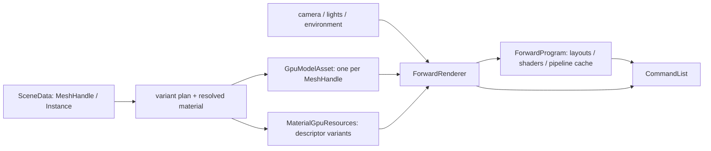

# 公共 Forward 渲染

核对日期：2026-10-07。本文只描述已实现的公共 Forward 路径。源码：[ForwardGraphTargets](../../src/KuEngine/Render/ForwardGraphTargets.h)、[ForwardDisplayPass](../../src/KuEngine/Render/ForwardDisplayPass.h)、[ForwardProgram](../../src/KuEngine/Render/ForwardProgram.h)、[ForwardRenderer](../../src/KuEngine/Render/ForwardRenderer.h)。

## 边界与所有权

`ForwardProgram` 独占固定 descriptor layout、公共 Forward shader 和有限的 `ForwardPipelineKey` 管线缓存；key 仅由 `ShadingModel`、`AlphaMode` 与 `doubleSided` 构成。`ForwardRenderer` 独占帧 UBO、按 draw 对齐的动态 UBO、frame/draw descriptor pool 与 set，并负责容量检查/扩展。`render()` 只在调用期间借用 `ForwardView`、`ForwardDraw`、`GpuModelAsset`、`MaterialGpuResources` 与环境资源；调用方必须让被借用的 GPU 资产活到 renderer 释放 descriptor pool 之后。

M3-WP03 将其 RHIShader 调用迁移为显式 path/stage/entry 的唯一 vertex/fragment 描述；M3-WP04 进一步将输出接入 Graph-owned SceneColor/Depth，Renderer 仍只拥有 GPU 资产与场景绘制资源，不拥有 targets。

公共 layout 固定如下，不能由业务 Pass 临时改变：set 0 为五个材质 sampler（base、normal、metallic-roughness、occlusion、emissive）；set 1 为 frame UBO；set 2 为 lat-long 环境 sampler；set 3 为动态 draw UBO。材质/环境资源在创建时借用 Program 的 layout；销毁顺序为 renderer、资产资源、program。

## 场景、材质和 draw

Scene 实例以稳定 `MeshHandle` 指向唯一 mesh；实例持有 TRS、可选 material reference 和显式 override。TRS 使用列向量 `T * Rz * Ry * Rx * S`，要求有限值和正 scale；fit 使用变换后的 AABB。`ResolvedMaterial` 合并 glTF 材质与实例 override，包含 PBR/Unlit、Opaque/Mask/Blend、cutoff、double-sided、五类 texture transform、scalar 和 UV 信息。`KHR_materials_unlit` 被映射为 Unlit。

GPU 材质 variant 只按会改变 descriptor 的 mesh、纹理 source、color space、channel mapping 去重，并按规范排序，使 index 与实例顺序无关；draw 保存稳定 variant index。scalar 和 UV-only override 仍进入 per-draw UBO，不拆 variant。legacy combined ORM 只在显式 MR/AO 都不存在时映射到两者，因此 UV-only override 不会破坏 embedded/legacy ORM。

每个 draw 写 model/normal matrix、factor、texture transform、flags 到动态 UBO。动态 offset 采用设备要求对齐，容量溢出或无效 draw 会返回错误而不是越界。一个 mesh 可由多实例共享 GPU 上传；不同纹理 override 必须建立独立 variant。

## 着色、顺序与生命周期

PBR 计算方向光、最多四个点光与基础 lat-long 环境贡献；Unlit 只输出材质颜色/emissive，不读取直接或环境光照。Skybox 使用同一环境输入。Forward 将 CLEAR/STORE 的 swapchain-relative `ForwardSceneColor`（color attachment + sampled）和 `ForwardSceneDepth`（depth attachment）声明为 Graph internal target；随后 `ForwardDisplayPass` 采样 SceneColor，CLEAR/STORE 写 external SwapChainColor，RuntimeOverlay 再 LOAD/read-write 后交给 Present。SceneColor 当前为 display-ready LDR，色调/gamma 仍在 Forward shader；没有线性 HDR 统一输出、完整 IBL 或 Deferred。

不透明和 Mask 先绘制；Blend 按对象中心相对相机的距离从后到前排序，距离相同按原始顺序稳定。Mask 执行 alpha discard 并写深度；Blend 使用 alpha blend、不开深度写；`doubleSided` 选择禁用 cull 的管线变体。排序是对象级，不解决相交透明几何。

Mclaren 及 ForwardReuse 都在现有单帧 Fence-safe Runtime 中拥有 Program/Renderer。Mclaren 在模型替换成功时重建其 mesh/variant/draw、确保管线和 renderer 容量；环境替换只重建环境资源并 rebind。失败保留已发布 state。多帧 retire、异步加载和跨场景缓存尚未实现。

Display 使用 `sceneFramebuffer` 计算 UV scale/offset，对 SceneColor 作 nearest pass-through，避免侧栏改变 source 与显示区域的对应关系。内部 pool 在 resize 重建 relative targets；Display 依据 resolved allocation generation/ImageView rebind descriptor。swapchain format 变化会重新 compile 相关 Pass 并重建 UI，同时保留 SidebarState；本轮未强制制造真实 live-format change。

## 接入示例

`ForwardReuseApp` 是最小公共使用者。它从 data-URI glTF semantic card 建立一个 mesh（4 primitives）和两个实例，产生两个 GPU descriptor variants、Forward+Display 精确 9 draws / 45 submitted vertices。它覆盖 PBR/Unlit、MR/AO/emissive UV、Opaque/Mask/Blend、double-sided、零光与背面视图预设；环境是内建 1×1 输入，不依赖外部 HDR。操作见 [ForwardReuse 使用说明](../usage/forward-reuse-example.md)。

Mclaren 现在也完全经公共 Forward 提交；旧 `MclarenRenderResources` 与旧 shader 文件可能仍在树中，但不再构建或运行，不能视作当前主路径。
