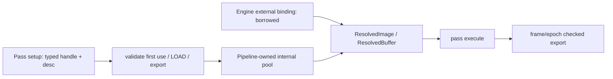

# Graph 资源与生命周期

核对日期：2026-10-07。本文描述已验收的 M3-WP01～04 图资源、同步、受约束执行与 Forward 输出。源码：[RenderGraph](../../src/KuEngine/Render/RenderGraph.h)、[资源池](../../src/KuEngine/Render/RenderGraphResourcePool.h)、[Pipeline](../../src/KuEngine/Render/RenderPipeline.h)、[Probe](../../examples/graph_resource_probe/GraphResourceProbePass.cpp)。

## 声明与类型安全

`RenderGraphBuilder` 以 `createImage`/`createBuffer` 声明内部资源，以 `importImage`/`importBuffer` 声明借用外部资源；返回的 `ImageHandle` 或 `BufferHandle` 带 index 与全局 graph generation。转为 `ResourceHandle` 时保留 kind。每次 Graph reset/新建都会取得新的 generation；过期、越界或 image/buffer kind 不匹配的 handle 会被拒绝。

同名资源必须拥有完全相同的 kind、ownership 与 descriptor，否者编译失败。`ImageDesc` 指定 absolute 或 swapchain-relative extent、format、usage、aspect、clear value、initial content；`BufferDesc` 指定 size、usage、VMA memory usage 与 initial content。当前 allocation 仍只支持 2D、mip 1、layer 1、sample 1 image，没有 3D、MSAA 或 aliasing；但 use/resolve 已接受并规范化 `ImageSubresourceRange` 与 `BufferRange`，检查请求范围包含于描述和已声明 use，planner 可对 range split/merge。

`Undefined` 资源不得首读；内部 `Cleared` image 的首次使用必须是 CLEAR attachment，internal buffer 不支持隐式 clear；LOAD 需要已定义内容。export 必须显式声明，且编译时要求最终存在可存储的已定义内容。同一 Pass 可通过显式 `ComputeStorageReadWrite` 等 read-write use 声明算法性读写；不接受隐式的、未声明 use/range 的同资源混用，attachment 与 native/callback 操作仍须符合各自的 scope/contract。

## 所有权、解析与失效

`RenderPipeline` 独占 `RenderGraph`、`RenderGraphResourcePool` 与 export lifetime state。pool 只分配/销毁 internal image/buffer；外部 binding 由调用方拥有，Pipeline 仅借用。外部 image/buffer bind 既可按 typed handle，也可按 name；两种路径都核对 kind/name、尺寸/format/aspect（image）、size（buffer）和非零 usage 是 expected usage 的完整超集，拒绝零、部分或错误用途。

执行时 Pass 从 resolver 获取 `ResolvedImage`/`ResolvedBuffer`，包含 Vulkan handle、descriptor-derived metadata、allocation generation、content-valid 和 external 标记。allocation 可跨帧缓存，但 `beginFrame` 使 internal transient content 无效，因此不能将上一帧内容隐式带入下一帧。

compile 和 resize 均先创建 candidate graph/pool；资源分配或 pass resize 失败不发布 candidate。resize 对 swapchain-relative image 重建，对 absolute image 转移既有 allocation；绑定被清除。Probe 可见 relative image allocation generation 从 1 到 2，而 absolute buffer 保持 1，extent 640×480 到 800×600。

`exportImage`/`exportBuffer` 只在成功 execute 后返回，并带 owner weak reference、epoch 与 frame serial。recompile/resize、下一帧开始或 Pipeline 销毁都会使 token 失效；只有完整且 content-valid 的 resolved 资源可被视为有效 export。

## 执行边界与 Probe

`GraphResourceProbeApp` 顺序执行 ImageClear、BufferFill、native Copy callback、normal Compute callback、Graphics SampleDraw 与 PostDrawCopy：覆盖 internal image/buffer resolve、内容传递、transfer/compute/graphics use、attachment→sample、resize，以及 1 draw/3 vertices 统计。运行方式见 [Probe 使用说明](../usage/graph-resource-probe-example.md)。

## 用途、状态与同步

每个 Pass 用显式 `ImageUse` / `BufferUse` 声明访问；语义映射到 stage、access、layout 和 image/buffer range。`RenderGraphStatePlanner` 是纯 CPU 预规划器：在 disabled mask 之后检查 producer/consumer，追踪 RAW/WAR/WAW、读者集合和 writer epoch，并对 image range、buffer range 进行 split/merge；每个 stage 使用实际 access 覆盖，避免将多个读者错误地作 Cartesian 组合。该计划产生 synchronization2 image/buffer barrier 批次，由 Pipeline 用 `vkCmdPipelineBarrier2` 记录。

资源池继续保存 allocation，Pipeline 将 execution resource state/content 分离为提交 shadow；只有成功录制的 pass 才将 state/content 提交回 shadow。checked resolver 要求调用方按已声明 use 及 range 解析资源；Overlay 只声明交换链 color read/write；acquire 等待以 `ALL_COMMANDS` 作保守 stage mask。

Probe 的完整路径为 ImageClear + Fill → native Copy callback → normal Compute callback → Graphics vertex/index/indirect draw → PostDrawCopy，共六 Pass、六 resource、六 dependency、五 barrier。它不是多队列、长时或视觉正确性验证。

M3-WP03 补上 Compute、受约束 native API 与 resolver range 检查；M3-WP04 已将 Graph-owned Forward SceneColor、Depth/display 交接落地。

## Compute 与受约束回调

M3-WP03 提供显式 `ShaderDesc(path, stage, entry)`；graphics pipeline 只接受唯一 vertex/fragment stage。`RHIComputePipeline` 是独立 RAII pipeline，`RHIParameterSet` 检查 UniformBuffer、StorageBuffer、CombinedSampler、StorageImage binding 并在创建/写入失败时回滚。设备选择优先具备 compute 的 graphics queue，不把它提升为全局硬要求。

`CallbackRenderPass` 由 Pipeline 拥有，按 declare/prepare/execute 生命周期运行；参数只读、recompile 后 handle 失效，并只稳定借用 `RHIDevice`。其 `GraphCommandContext` 仅允许已声明 handle/use/range 的 resolve、fill/copy、compute pipeline/parameter binding 和 dispatch。`NativeCommandScope` 还要求已知 capability/side-effect 及声明 use 子集，并受执行生命周期限制；Callback 构造时拒绝 unknown flag，attachment scope 禁止 Compute/Transfer。旧对象标为 `TrustedLegacyObject`；系统不能自动检测任意裸 Vulkan 命令。

Probe 现为六 pass、六 resource、六 dependency、五 barrier：ImageClear 与 Fill 后依次 native Copy callback、normal Compute callback、Graphics vertex/index/indirect draw、PostDrawCopy；compute shader local size 为 32、group count 为 1。它在 resize 后观察相对 image generation 递增、absolute buffer generation 保持，统计 1 draw/3 vertices。M3-WP04 已在 Forward 路径完成 SceneColor/Depth/display 交接。

## Forward 图目标与显示

`ForwardGraphTargets` 从 `RenderContext` 的 color/depth format 与 clear value 声明 swapchain-relative internal `ForwardSceneColor`（COLOR_ATTACHMENT | SAMPLED，CLEAR/STORE）和 `ForwardSceneDepth`（CLEAR/DONT_CARE）。Mclaren 与 ForwardReuse 的 Forward write 先写这对目标；`ForwardDisplayPass` 再以 FragmentSampled 读取 SceneColor，CLEAR/STORE 写借用的 SwapChainColor，RuntimeOverlay LOAD/read-write，最终由 Runtime 交给 Present。pool 负责 target allocation 与 resize；Renderer 不取得 target 所有权。

Display 对 `sceneFramebuffer` 生成 UV scale/offset 并 nearest pass-through。relative target resize 会使 allocation generation 变化，Display 在 generation 或 ImageView 变化时重绑 descriptor；format 变化会重新 compile 相关 Pass/重建 UI，SidebarState 保留。Probe 的 ParameterSet 初始化使用候选发布，重复 compile 释放顺序已覆盖；`--smoke-recompile-after-setup` 在 deviceWaitIdle 后进行同一 Pipeline 的第二次 compile。没有强制 live format-change、资源别名或多 Queue 实机验收。
