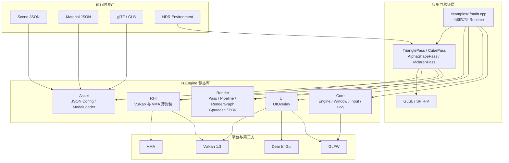
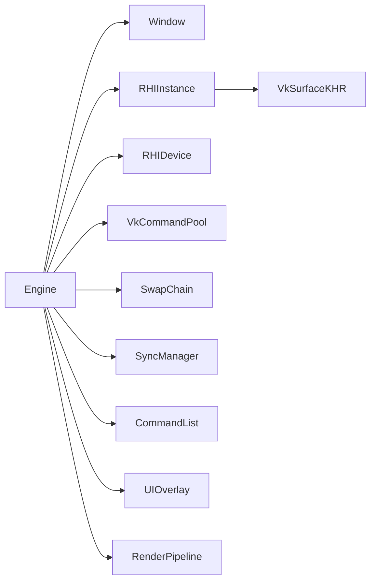
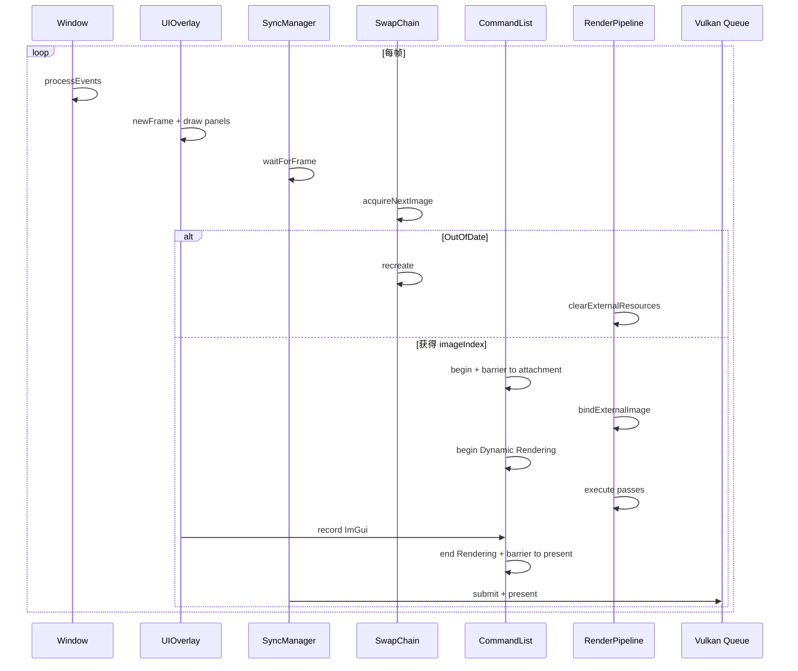
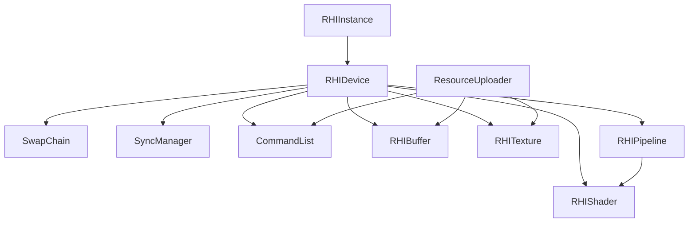
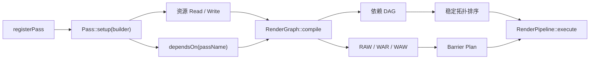
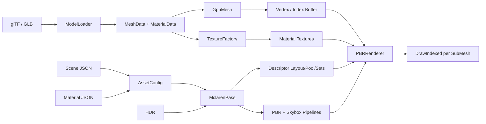
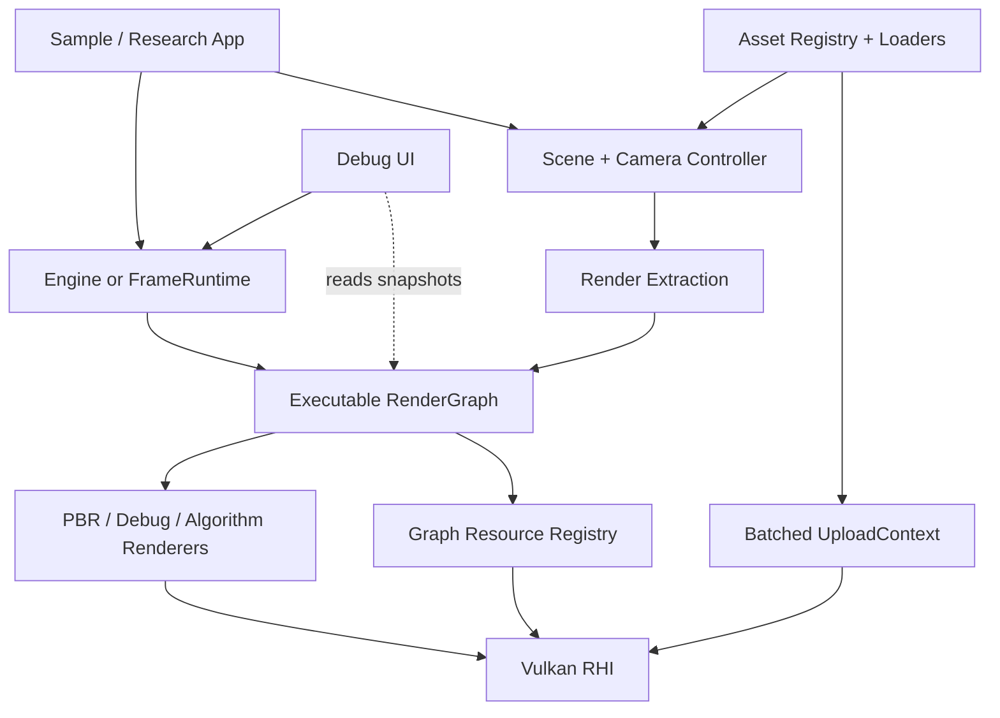

# KuEngine 现有代码架构分析

> 分析基线：2026-07-25 仓库状态<br>
> 完成日期：2026-07-26<br>
> 分析范围：`src/`、`examples/`、`resources/`、`tests/` 与 CMake 配置<br>
> 文档性质：以**还原现状**为主；标有“优化建议”的内容不代表当前代码已经实现

---

## 1. 架构结论

KuEngine 是一个基于 Vulkan 1.3、C++20 和 Dynamic Rendering 的早期实时渲染框架，目标是保留 Vulkan 的显式控制能力，同时减少实例、设备、交换链、资源、同步与图形管线的重复样板代码，以便快速验证图形算法。

当前代码已经形成六个主要模块：

| 模块 | 当前职责 |
|---|---|
| `Core` | 窗口、输入、日志，以及尚未接通实际渲染的 `Engine` 外壳 |
| `RHI` | Vulkan Instance、Device、SwapChain、Command、Sync、Buffer、Texture、Shader、Pipeline 与上传器 |
| `Render` | Pass 生命周期、RenderPipeline、RenderGraph Alpha、GPU Mesh、纹理工厂与初步 PBR 公共能力 |
| `Asset` | JSON 场景/材质配置解析，以及 glTF/GLB 的 CPU 侧模型与纹理提取 |
| `UI` | Dear ImGui 的 GLFW + Vulkan Dynamic Rendering 接入 |
| `examples` | 算法验证程序，同时也是当前真正的应用运行时 |

最重要的现状是：

> **`Core::Engine` 表达的是未来统一运行时，而四个示例的 `main.cpp` 才是目前真正可运行的逐帧调度路径。**

`Engine` 已经聚合窗口、RHI、交换链、同步、命令、UI 和渲染管线，但 `Engine::render()` 仍为空。Triangle、Cube、Alpha3Pass 和 Mclaren 分别在自己的 `main.cpp` 中重复执行初始化、Acquire、布局转换、Dynamic Rendering、提交、呈现和交换链重建。

因此，当前项目最准确的描述是：

> 一套已经具备合理基础分层的 Vulkan 实验框架，加上一组各自拥有 Runtime 的验证程序；统一帧运行时、完整 RenderGraph 资源管理和成熟的资产/PBR 系统仍在收敛。

---

## 2. 仓库与构建组织

```text
KuEngine/
├── CMakeLists.txt
├── CMakePresets.json
├── vcpkg.json
├── src/
│   ├── CMakeLists.txt
│   └── KuEngine/
│       ├── KuEngine.h
│       ├── Core/
│       ├── RHI/
│       ├── Render/
│       ├── Asset/
│       └── UI/
├── examples/
│   ├── triangle/
│   ├── cube/
│   ├── alpha3pass/
│   └── mclaren/
├── resources/
│   ├── models/
│   ├── materials/
│   ├── scenes/
│   ├── environments/
│   ├── manifests/
│   └── shaders/
├── tests/
│   └── core/
└── docs/
    └── structure/
```

### 2.1 CMake 目标

| 目标 | 类型 | 作用 |
|---|---|---|
| `KuEngine` | 静态库 | 汇集 `src/KuEngine/**` 下的公共框架代码 |
| `TriangleApp` | 可执行程序 | 最小三角形、Push Constant 与运行时颜色调节 |
| `CubeApp` | 可执行程序 | 程序化立方体、相机矩阵、鼠标旋转与线框切换 |
| `Alpha3PassApp` | 可执行程序 | 三个 Pass、共享颜色目标和显式依赖顺序 |
| `MclarenApp` | 可执行程序 | glTF、JSON 材质、纹理、HDR、深度、Skybox 与 PBR 综合路径 |
| `test_core` | 测试程序 | RenderGraph、资产配置和版本宏的 CPU 侧测试 |

### 2.2 第三方依赖

| 依赖 | 用途 |
|---|---|
| Vulkan | 图形 API |
| Vulkan Memory Allocator | Buffer/Image 内存分配 |
| GLFW | 窗口、Surface 与输入 |
| Dear ImGui | 调试面板和参数调节 |
| spdlog / fmt | 日志与格式化 |
| GLM | 向量、矩阵和相机计算 |
| nlohmann-json | 场景与材质 JSON |
| tinygltf + stb_image | glTF/GLB、图片与 HDR 加载 |
| GoogleTest | 单元测试 |

`KuEngine` 当前将大部分依赖声明为 `PUBLIC`。这让示例接入很方便，但也意味着应用会继承较大的 include 与链接依赖面。

---

## 3. 总体分层与依赖



### 3.1 当前并非严格单向分层

整体依赖方向接近“应用 → Render/Asset → RHI”，但仍存在早期阶段的交叉：

- `Core::Engine` 直接聚合 RHI、Render 和 UI。
- `RenderPipeline.cpp` 直接调用 ImGui 绘制 RenderGraph 调试面板。
- `PBRCommon` 同时依赖 Asset 数据结构和 Vulkan 格式/描述符类型。
- `PBRRenderer` 直接提交 Vulkan Descriptor Set、Push Constant 与 Draw 指令。
- `MclarenPass` 同时负责编排资产、创建 GPU 资源、构建描述符/管线、更新相机灯光和绘制 UI。
- 示例 `main.cpp` 直接使用 `vkCmdBeginRendering` 等原生 Vulkan 命令。

这不是完全错误的设计：项目明确需要快速验证 Vulkan 算法，保留逃生口是合理的。真正的问题是公共职责与示例职责尚未形成稳定边界。


---

## 4. 两套运行时形态

### 4.1 `Engine` 所表达的目标形态

`Core/Engine` 已经勾勒出统一 Runtime：



构造顺序依次为窗口、Instance/Surface、Device/CommandPool、SwapChain/Sync/Command、UI 和 RenderPipeline；析构时先等待 Device Idle，再大体反向释放，符合 Vulkan 父子对象生命周期要求。

但当前 `Engine::render()` 为空，帧索引与最小化状态没有进入真实调度；`Engine::run()` 只轮询事件并休眠。因此它目前是架构骨架，不是示例使用的有效渲染入口。

### 4.2 示例采用的实际形态

四个示例通过栈对象和嵌套作用域管理：

```text
Window
└── RHIInstance
    └── VkSurfaceKHR
        └── RHIDevice
            ├── VkCommandPool
            ├── SwapChain / SyncManager / CommandList
            ├── UIOverlay
            ├── RenderPipeline → RenderPass
            └── 示例专用资源
```

这种写法直观且便于 Vulkan 初期调试，但已经形成四份高度相似的帧循环。

### 4.3 当前真实帧流程



关键现状：

- 示例均使用 `SyncManager(device, 1)`，实际只有一帧在途。
- 交换链图像布局由示例侧 `std::vector<VkImageLayout>` 跟踪。
- Dynamic Rendering、附件、Viewport 和 Scissor 均由示例负责。
- `RenderPipeline` 被设置为在 Rendering Scope 内执行，因此会跳过需要布局转换的 RenderGraph Barrier。
- SwapChain 重建会清空外部资源绑定并通知 UI；Mclaren 还会重建深度附件。

---

## 5. Core 模块

### 5.1 `Window`

`Window` 封装 GLFW 生命周期、无客户端 API 窗口、Framebuffer Resize/Close 回调与原生句柄。文件内全局计数保证第一个窗口初始化 GLFW、最后一个窗口终止 GLFW。

当前问题：Resize 回调没有同步成员宽高；`swapBuffers()` 对 Vulkan 无实际作用；全局窗口计数没有线程同步；示例又单独维护 `resizeRequested`，形成重复状态。

### 5.2 `Input`

`Input` 是静态状态容器，保存键盘、鼠标按钮、位置和逐帧 Delta。Cube 与 Mclaren 仍直接调用 GLFW 处理拖拽，说明 Input 尚未接入公共 Runtime。

### 5.3 `Log`

`Log` 对 spdlog 做轻量封装，建立 `KuEngine` 彩色控制台 Logger，并暴露 `KU_TRACE` 至 `KU_CRITICAL` 宏。

### 5.4 `Engine`

`Engine` 尚缺少可用的 `render()`、Pass/场景注册入口、交换链与深度附件统一恢复、完整帧状态和输入接入。后续公共功能应优先迁入 `Engine` 或独立 `FrameRuntime`，避免继续扩张四份示例循环。
---

## 6. RHI 模块

RHI 的定位是“保留 Vulkan 对象与显式同步语义的薄封装”，而不是隐藏 API 的跨平台抽象。



### 6.1 类职责

| 类 | 主要对象 | 当前职责 |
|---|---|---|
| `RHIInstance` | `VkInstance` | Vulkan 1.3 Instance、Validation Layer、Surface |
| `RHIDevice` | Physical/Logical Device、Queue、VMA | GPU 选择、队列、逻辑设备与分配器 |
| `SwapChain` | Swapchain、Images、ImageViews | 格式/模式/尺寸选择、Acquire 与重建 |
| `SyncManager` | Semaphore、Fence | 等待帧、提交、呈现与 Frame Index |
| `CommandList` | Primary CommandBuffer | begin/end、Image Barrier、Buffer/Image Copy |
| `RHIBuffer` | `VkBuffer` + VMA Allocation | 创建、映射、刷新与释放 Buffer |
| `RHITexture` | `VkImage` + Allocation + View | 创建单层、单 mip 2D Image |
| `RHIShader` | `VkShaderModule` | 从 SPIR-V 文件创建 Shader Module |
| `RHIPipeline` | Pipeline + Layout | Vertex/Fragment Graphics Pipeline |
| `ResourceUploader` | 独立 CommandPool | 使用 Staging Buffer 即时上传 |

### 6.2 初始化与设备选择

`RHIInstance` 请求 Vulkan 1.3，从 GLFW 获取所需扩展，并在 Debug 构建启用 `VK_LAYER_KHRONOS_validation`。当前没有创建 Debug Messenger。

`RHIDevice` 优先选择第一个离散 GPU，否则选择第一个枚举设备；分别查找 Graphics 与 Present Queue，启用 SwapChain、Dynamic Rendering、Synchronization2，并创建 VMA Allocator。

当前设备选择尚未完整验证所需 Feature、SwapChain Extension、Surface Format 和 Present Mode。Present Queue 缺失时会回退到 Graphics Queue，但没有重新证明该 Queue 支持 Present。这在多 GPU 或特殊 Surface 环境中可能选出不适用设备。

### 6.3 SwapChain

交换链优先 `B8G8R8A8_UNORM + SRGB_NONLINEAR`、Mailbox，否则 FIFO；图像数为 `minImageCount + 1`，Graphics/Present Queue 不同则使用 Concurrent Sharing，Image Usage 只有 `COLOR_ATTACHMENT`。

`recreate()` 通过 `device.waitIdle()` 后销毁旧对象再完整创建，逻辑简单，但没有利用 `oldSwapchain`，每次恢复都会造成全设备停顿。

### 6.4 同步、命令与 Barrier

每个 Frame Slot 包含 `imageAvailable`、`renderFinished` 和 `inFlight Fence`。`CommandList` 仍调用旧版 `vkCmdPipelineBarrier`，没有使用已启用的 Synchronization2。

当前 Barrier 映射主要覆盖颜色附件、Shader Read、Transfer、General 和 Present；Depth Attachment 的 Access Mask 不完整。Barrier 还固定操作 mip 0、layer 0、数量 1，不处理 Queue Family Ownership Transfer。这符合当前单层 2D 纹理，但不支持 Cubemap、Mip Chain 或 Texture Array。

### 6.5 资源上传

`RHIBuffer` 与 `RHITexture` 使用 VMA；`TextureFactory` 提供通用 2D、RGBA8 和纯色纹理创建。`ResourceUploader` 对每个资源单独建立 Staging Buffer、分配命令、提交并 `vkQueueWaitIdle()`。

这条路径适合验证正确性，但会对每个资源同步阻塞。Mclaren 加载多个材质纹理时，上传成本随资源数量线性增长；后续适合改为批量上传上下文、复用命令缓冲并以 Fence 回收临时资源。

### 6.6 Graphics Pipeline

`RHIPipeline` 支持 Dynamic Rendering、动态 Viewport/Scissor、顶点输入、Descriptor Set Layout、Push Constant、Depth、Cull、Blend 与拓扑。

限制包括：固定将前两个 Shader 解释为 Vertex/Fragment、没有 Compute Pipeline 和 Pipeline Cache、多附件 Blend 与深度比较等状态配置不完整。示例还普遍硬编码 `B8G8R8A8_UNORM`，没有从实际 SwapChain Format 注入。

---

## 7. Render 模块

### 7.1 `RenderPass` 生命周期

```text
name()        稳定名称，参与 RenderGraph 依赖解析
initialize()  创建 Device 相关资源
setup()       声明资源读写和显式 Pass 依赖
execute()     记录逐帧绘制命令
drawUI()      独立 ImGui 面板
drawUIInline()可嵌入公共面板的 UI
onResize()    接收尺寸变化
```

`setup(RenderGraphBuilder&)` 默认会转调无参数 `setup()`，是兼容旧 Pass 的过渡设计。所有方法除 `name()` 外都有默认空实现，便于快速实现实验 Pass，但也可能让遗漏初始化或资源声明静默通过。

### 7.2 RenderGraph Alpha



RenderGraph 当前保存的是逻辑描述：

- `ResourceDesc` 只有名称和 `external` 标志。
- Pass 声明对资源的 Read/Write。
- 编译器根据注册顺序比较共享资源访问，生成 RAW、WAR、WAW 依赖和 Barrier Plan。
- 显式依赖按 Pass 名称解析。
- 使用 Kahn 拓扑排序；可检测缺失依赖、重名 Pass 和环。

重要限制是：资源危险边的方向仍以 Pass 注册顺序为基础。RenderGraph 能验证和固定已有声明顺序，但还不是根据目标输出反向推导、裁剪和自动调度的完整 FrameGraph。

### 7.3 `RenderPipeline`

`compile()` 会依次初始化 Pass、调用 setup、编译 RenderGraph，缓存执行顺序，并记录依赖、Barrier 和顺序的日志/ImGui 调试信息。

`execute()` 按编译顺序执行启用的 Pass。对于通过 `bindExternalImage()` 绑定的外部图像，它可以根据目标 Pass 的读写模式推导布局并调用 `CommandList::imageBarrier()`。

但当前四个示例把所有 Pass 放在同一个 Dynamic Rendering Scope 内，并设置 `setExecuteInsideRendering(true)`。Vulkan 不允许在该区域随意做图像布局转换，所以 Pipeline 会跳过这些 Barrier。Alpha3Pass 中三个 Pass 都写同一个已处于 Color Attachment Layout 的交换链图像，实际顺序来自依赖图，实际内存/布局控制仍主要由示例完成。

### 7.4 RenderGraph 的能力边界

当前已经实现：

- 命名逻辑资源；
- 外部资源标记与逐帧绑定；
- 显式和资源危险依赖；
- 确定性拓扑排序与环检测；
- 图片布局 Barrier 的初步落地；
- 编译与最近一次执行的 ImGui 可视化。

当前尚未实现：

- 逻辑资源到真实 Image/Buffer 的自动创建与生命周期；
- Buffer Barrier、Queue Ownership 与多队列同步；
- Attachment 的格式、尺寸、Load/Store、Clear 声明；
- Pass Culling、Transient Resource Alias；
- 自动划分 Dynamic Rendering Scope；
- 以 Vulkan Stage/Access/Layout 为核心的完整使用描述。

### 7.5 网格、材质与 PBR 公共代码

- `GpuMesh` 将 `MeshData` 上传为 Vertex/Index Buffer，并保留 SubMesh 范围。
- `TextureFactory` 将 CPU 像素数据转为采样纹理。
- `Material` 保存 `MaterialConfig`，`MaterialInstance` 关联 Material 与 `PBRMaterialBinding`。
- `PBRCommon` 定义 GPU 常量布局、材质绑定、颜色空间和 glTF Texture Source 解析辅助函数。
- `PBRRenderer` 负责绑定管线、三组 Descriptor Set、Vertex/Index Buffer、逐 SubMesh Push Constant/UBO 与 DrawIndexed。

`Material`/`MaterialInstance` 已经出现，但当前 Mclaren 主路径仍直接构造 `PBRMaterialBinding`，说明材质对象层尚未真正成为运行时主干。

`PBRRenderer::initialize()` 目前为空，管线和 Descriptor 等资源仍由 `MclarenPass` 创建后注入。它已经抽走“怎么提交一批 Draw”，但还没有接管“怎么创建并拥有 PBR Renderer”。

---

## 8. Asset 与 PBR 数据流

### 8.1 JSON 配置

`AssetConfig` 提供：

- `SceneConfig`：Camera、Directional Lighting 与 Node 的 Model/Material 路径；
- `MaterialConfig`：PBR 因子、Alpha、Double Sided，以及 BaseColor/Normal/ORM Texture Binding；
- `findResourcesRoot()`：从给定路径向上定位 `resources`；
- 加载失败通过 `bool + errorMessage` 返回，而不是抛异常。

场景 JSON 中存在 `transform`、描述、版本等字段，但当前 `SceneNodeConfig` 只保存 `id/model/material`，节点变换没有进入运行时数据结构。资产注册表目前也只是数据文件，没有看到公共 Registry 类消费它。

### 8.2 glTF/GLB 加载

`ModelLoader` 使用 tinygltf：

1. 读取 ASCII glTF 或二进制 GLB。
2. 遍历默认 Scene 的 Node 层级并累积 World Matrix。
3. 合并 Primitive 到统一 Vertex/Index 数组。
4. 读取 Position、Normal、Tangent、UV0/UV1；缺失 Normal 时重建。
5. 提取 SubMesh 与 Material Index。
6. 将 glTF 图片统一展开为 RGBA8。
7. 提取 BaseColor、Normal、MetallicRoughness/ORM、Emissive 与 Texture Transform。

节点 World Transform 已经烘焙到顶点和法线中，因此 CPU 结果是扁平合并网格，不再保留完整场景层级、实例和蒙皮信息。这适合静态模型验证，但限制了实例化、动画和独立节点变换。

### 8.3 Mclaren 综合路径



`MclarenPass` 是当前功能最完整、也最重的类。它负责场景/材质路径发现、多模型合并、模型适配缩放、GPU Mesh、回退纹理、HDR、Sampler、Descriptor、Uniform Buffer、PBR/Skybox Pipeline、相机灯光、材质参数、UI 和逐帧 Draw Item 构造。

这条路径证明了公共组件能够组合出完整结果，但也揭示了最主要的职责堆积点。`MclarenPass.cpp` 超过千行，是后续重构的首要候选。

值得特别注意：`PBRRenderer` 在每个 Draw 前把对应 `PBRFrameUniforms` Map/复制/Flush/Unmap 到同一个 UBO。因为录制命令时 Descriptor 始终引用同一内存，多个 Draw 是否真正看到各自数据取决于提交前最终内存内容，而不是录制时的 CPU 写入时刻。当前每材质不同的 Emissive/Alpha 更适合进入 Push Constant、Dynamic UBO Offset、Storage Buffer 或每 Draw 独立区域。

---

## 9. UI 模块

`UIOverlay` 创建唯一 ImGui Context、GLFW Backend、Vulkan Backend 和一个 Combined Image Sampler Descriptor Pool。后端启用 Dynamic Rendering，并接收颜色与可选深度格式。

逐帧顺序是 `newFrame()`、构建 FPS/Pass/RenderGraph 面板、在应用已有 Rendering Scope 内调用 `render()`。交换链重建时只更新 ImGui 的最小 Image Count。

当前限制：

- 类默认假设进程内只有一个 ImGui Context/Overlay。
- Descriptor Pool 只声明 Combined Image Sampler 类型，未来通用 UI 资源可能需要更多类型。
- `render()` 的 `imageView` 与 `imageLayout` 参数没有实际使用，接口与实现存在冗余。
- RenderGraph Debug UI 位于 Render 模块，造成 Render → ImGui 的直接依赖；可考虑改为只暴露 Debug Snapshot，由 UI 层负责展示。

---

## 10. 示例的架构角色

| 示例 | Pass/资源声明 | 验证重点 | 当前特殊逻辑 |
|---|---|---|---|
| Triangle | 单 Pass 写 `SwapChainColor` | 最小 Dynamic Rendering、Push Constant、ImGui | 无顶点 Buffer，`vkCmdDraw(3)` |
| Cube | 单 Pass 写 `SwapChainColor` | MVP、鼠标旋转、线框/实心 Pipeline | CPU/Shader 生成立方体，无深度附件 |
| Alpha3Pass | 三 Pass 均写同一外部颜色资源，并显式串联 | RenderGraph 顺序、WAW 与混合叠加 | 共用一个 Rendering Scope |
| Mclaren | 单 PBR Pass 写颜色目标 | 资产、材质、深度、HDR、Skybox、PBR | 自建深度附件和大部分渲染资源 |

这些示例既是回归样例，也是框架尚未吸收职责的暂存区。阅读顺序建议从 Triangle 理解帧流程，再看 Alpha3Pass 理解 RenderGraph，最后看 Mclaren 理解资产到 GPU 的完整路径。

---

## 11. 测试与可验证性

`test_core` 当前包含：

- RenderGraph 显式依赖、资源依赖、RAW/WAR/WAW、外部资源、缺失依赖和环检测；
- Scene/Material JSON 的完整字段、默认值和缺失文件；
- `KU_VERSION` 宏。

明显空白：

- `test_engine.cpp` 实际只测版本，并未测试 Engine。
- ModelLoader、PBRCommon、资源根目录边界案例缺少测试。
- RHI、交换链恢复、Barrier 和上传没有自动化验证。
- 四个图形示例没有 Headless/截图基准或 Validation Layer 回归测试。

早期阶段可优先增加不依赖 GPU 的 ModelLoader/PBR 数据转换测试，再逐步加入带 Validation Layer 的 Smoke Test。

---

## 12. 主要问题与优化优先级

以下排序同时考虑了重复成本、正确性风险和对算法验证效率的影响。

### P0：正确性与统一运行时

1. **收敛帧循环**：将 Acquire、同步、布局、Dynamic Rendering、UI、Present 和 SwapChain 重建迁入公共 Runtime。
2. **修正每 Draw UBO 更新模型**：采用 Dynamic UBO、SSBO、Push Constant 或分配不同偏移，避免多个 Draw 共享同一最终内存。
3. **完善设备适用性检查**：在创建设备前验证 Queue、Feature、Extension 与 SwapChain 支持。
4. **补全 Depth Barrier**：明确 Depth Stage/Access/Layout，并统一使用 Synchronization2。

### P1：RenderGraph 从“分析器”走向“执行器”

1. 让资源声明包含类型、格式、尺寸、用途和 Attachment 语义。
2. 由 Graph 创建/导入资源并维护真实布局状态。
3. 根据 Barrier 需求自动切分 Rendering Scope，而不是由 `executeInsideRendering` 整体跳过。
4. 支持 Buffer、Depth、多个颜色附件和多队列。
5. 让危险依赖基于更明确的版本/生产者语义，而非单纯注册顺序。

### P1：拆分 MclarenPass

建议逐步抽出：

- `SceneLoader/SceneAsset`：场景、模型和材质引用；
- `MaterialSystem`：纹理解析、回退纹理与 MaterialInstance；
- `DescriptorAllocator`：Layout/Pool/Set 生命周期；
- `UploadContext`：批量异步上传；
- `PBRPipelineFactory`：PBR/Skybox Pipeline；
- `CameraController`：轨道相机和输入；
- `EnvironmentResource`：HDR 与后续 IBL 资源。

### P2：API 与工程卫生

- 让 SwapChain Format 驱动 Pipeline，而不是硬编码。
- 缩小 `KuEngine` 的 `PUBLIC` 依赖范围。
- 移除或实现无效接口，如 Vulkan 窗口的 `swapBuffers()`。
- 统一错误模型；当前混用异常、`bool + error` 和日志后静默返回。
- 避免 `RenderPass` 默认空实现隐藏关键步骤遗漏。
- 为公共头文件补齐自包含 include；例如使用 `memcpy` 的实现应直接包含 `<cstring>`。
- 统一命名：RHI Pipeline 与 Render Pipeline 容易混淆，可考虑 `GraphicsPipeline` 与 `PassPipeline`。

---

## 13. 建议的演进目标

下面是建议方向，不是现有实现：



推荐迁移顺序：

1. 先复制 Triangle 的已验证帧流程到公共 Runtime，并让 Triangle 成为第一个消费者。
2. 让 Cube 和 Alpha3Pass 复用 Runtime，验证输入、多个 Pass 与 Resize。
3. 修正 PBR per-draw 数据和批量上传，再迁移 Mclaren。
4. 最后扩展 RenderGraph 的真实资源所有权与 Rendering Scope 调度。

这种顺序能让每一步都有可运行示例作为回归基线，避免一次性重写早期但仍在快速变化的架构。

---

## 14. 快速定位索引

| 想了解的问题 | 首选代码入口 |
|---|---|
| Vulkan 如何初始化 | `src/KuEngine/RHI/RHIInstance.cpp`、`RHIDevice.cpp` |
| 当前一帧如何运行 | `examples/triangle/main.cpp` |
| Pass 如何声明和执行 | `Render/RenderPass.h`、`RenderPipeline.cpp` |
| RenderGraph 如何建依赖 | `Render/RenderGraph.cpp`、`tests/core/test_render_graph.cpp` |
| GPU 资源如何上传 | `RHI/ResourceUploader.cpp`、`Render/GpuMesh.cpp`、`TextureFactory.cpp` |
| 场景和材质如何读取 | `Asset/AssetConfig.cpp` |
| glTF 如何转成 MeshData | `Asset/Model.cpp` |
| PBR 完整路径 | `examples/mclaren/MclarenPass.cpp` |
| ImGui 如何接入 | `UI/UIOverlay.cpp` |
| 统一 Runtime 进度 | `Core/Engine.cpp` |

---

## 15. 总结

KuEngine 的基础方向是合理的：RHI 没有过度隐藏 Vulkan，Pass 适合作为算法验证单元，RenderGraph 已经能分析依赖和危险，Mclaren 又验证了从配置与 glTF 到 PBR 绘制的端到端链路。

当前最大的结构性矛盾不是“缺少更多封装”，而是**已经验证过的公共职责仍留在示例中**。近期最有价值的工作是统一帧 Runtime、修正 PBR per-draw 数据、完善设备/Barrier 正确性，再让 RenderGraph 从逻辑分析逐渐接管真实资源与执行边界。
