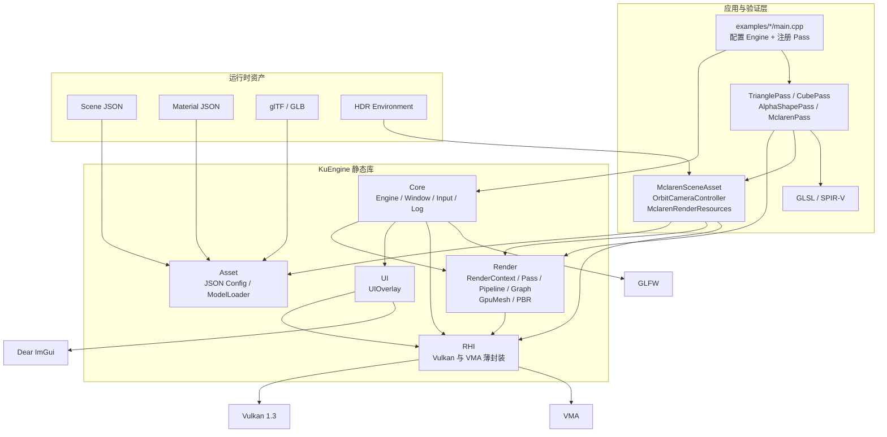
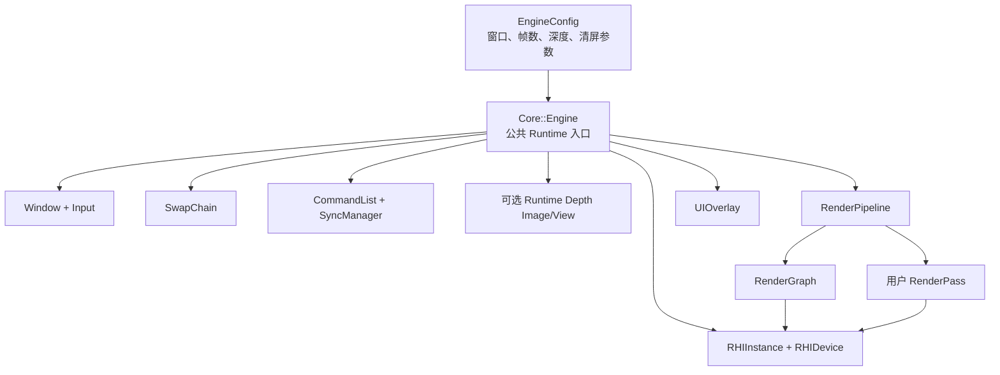
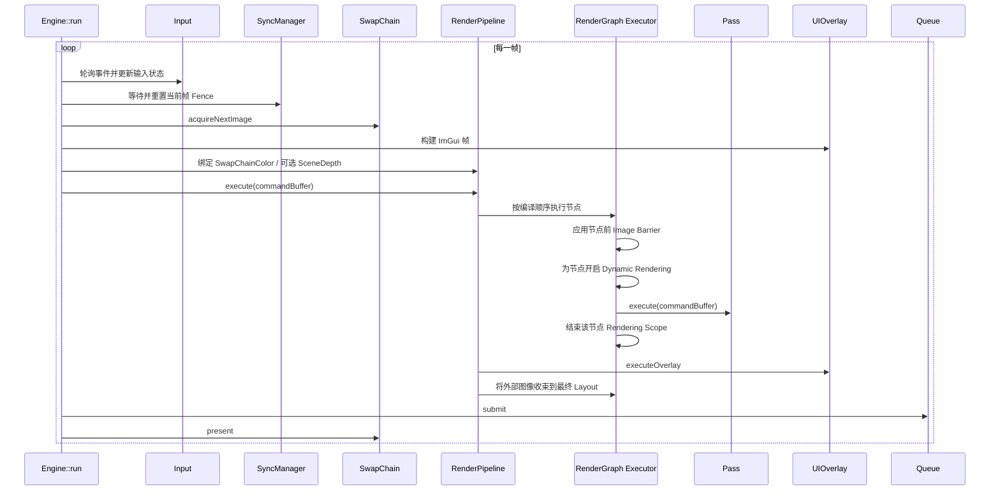
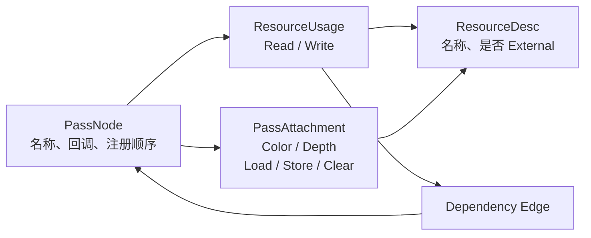
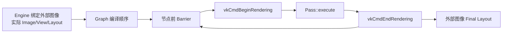
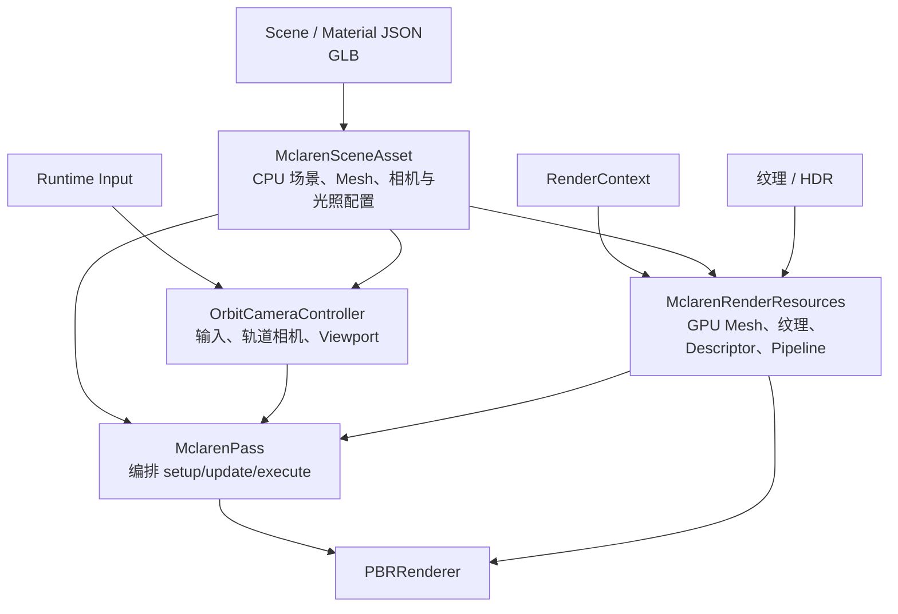
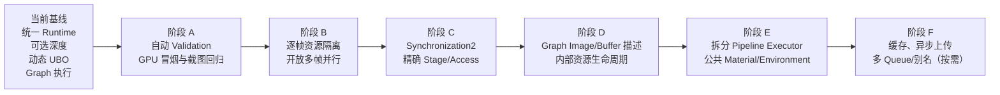

# KuEngine 当前代码架构分析

> 分析基线：提交 `c0399e1`（2026-07-26）
> 完成日期：2026-07-26
> 分析范围：`src/`、`examples/`、`resources/`、`tests/` 与 CMake 配置
> 对照文档：`docs/structure/Structure_725.md`
> 文档性质：以还原当前实现为主；标有“优化建议”的内容不代表已经实现

---

## 1. 架构结论

KuEngine 是一个基于 Vulkan 1.3、C++20 和 Dynamic Rendering 的早期实时渲染框架。项目保留 Vulkan 的显式控制能力，同时用较薄的公共层减少窗口、设备、交换链、资源、同步、管线和逐帧调度的重复代码，以便快速验证图形算法。

当前代码仍由六个主要模块构成，但职责边界已经比 `Structure_725.md` 所记录的状态更清晰：

| 模块 | 当前职责 |
|---|---|
| `Core` | 窗口、输入、日志，以及已经投入实际使用的公共 `Engine` Runtime |
| `RHI` | Vulkan Instance、Device、SwapChain、Command、Sync、Buffer、Texture、Shader、Pipeline 与上传器 |
| `Render` | RenderContext、Pass 生命周期、可执行 RenderGraph、RenderPipeline、GpuMesh、纹理工厂与 PBR 公共能力 |
| `Asset` | JSON 场景/材质配置解析，以及 glTF/GLB 的 CPU 侧模型与纹理提取 |
| `UI` | Dear ImGui 的 GLFW + Vulkan Dynamic Rendering 接入 |
| `examples` | 算法验证程序；入口只负责配置 Runtime、注册 Pass 和启动运行 |

最重要的现状已经变为：

> **`Core::Engine` 是四个示例共同使用的真实 Runtime；`RenderGraph` 不再只分析顺序，而是实际控制外部图像布局、Pass 屏障和 Dynamic Rendering 区间。**

Triangle、Cube、Alpha3Pass 和 Mclaren 的 `main.cpp` 已不再各自维护 Vulkan 帧循环。Acquire、同步、外部附件绑定、UI、提交、Present 和 SwapChain 重建都集中在 `Engine`。各 Pass 通过 `RenderGraphBuilder` 声明颜色/深度附件，由 `RenderPipeline` 按图执行。

### 1.1 相比 Structure_725 的主要变化

| `Structure_725` 中的状态 | 当前状态 |
|---|---|
| `Engine::render()` 为空，只是未来 Runtime 骨架 | `Engine` 已运行完整帧循环，四个示例全部迁入 |
| 四个示例各自维护窗口、Acquire、Submit、Present | 示例入口只创建 `Engine`、注册 Pass、调用 `run()` |
| SwapChain Format 在示例管线中硬编码 | 通过 `RenderContext` 注入实际颜色/深度格式 |
| Mclaren 自建深度附件 | Runtime 提供可选 `SceneDepth` |
| RenderGraph Barrier 因处于统一 Rendering Scope 内而跳过 | 每个图形 Pass 拥有独立 Scope，Barrier 在 Scope 外真实执行 |
| RenderGraph 不描述附件 Load/Store | 已支持颜色/深度附件与 Runtime/Clear/Load/DontCare 策略 |
| PBR 多 Draw 反复覆盖同一 UBO | 改为对齐的 Dynamic UBO 区域与逐 Draw Dynamic Offset |
| `MclarenPass.cpp` 超过千行并混合所有职责 | 拆为 SceneAsset、OrbitCamera、RenderResources 和薄 Pass |
| 设备优先选独显但不完整校验适用性 | 先验证 Vulkan 1.3、队列、扩展、Surface 和关键 Feature，再评分选择 |

当前项目可以概括为：

> 一套已经拥有统一单帧 Runtime 和初步可执行 RenderGraph 的 Vulkan 实验框架；真实图像附件执行已经收敛，内部图资源分配、多帧资源复制和更完整同步仍是下一阶段重点。

---

## 2. 仓库与构建组织

```text
KuEngine/
├── CMakeLists.txt
├── CMakePresets.json
├── vcpkg.json
├── src/
│   ├── CMakeLists.txt
│   └── KuEngine/
│       ├── KuEngine.h
│       ├── Core/
│       ├── RHI/
│       ├── Render/
│       ├── Asset/
│       └── UI/
├── examples/
│   ├── triangle/
│   ├── cube/
│   ├── alpha3pass/
│   └── mclaren/
│       ├── MclarenPass.*
│       ├── MclarenSceneAsset.*
│       ├── MclarenRenderResources.*
│       └── OrbitCameraController.*
├── resources/
│   ├── models/
│   ├── materials/
│   ├── scenes/
│   ├── environments/
│   ├── manifests/
│   └── shaders/
├── tests/
│   └── core/
└── docs/
    └── structure/
```

### 2.1 CMake 目标

| 目标 | 类型 | 作用 |
|---|---|---|
| `KuEngine` | 静态库 | 汇集 `src/KuEngine/**` 下的公共框架代码 |
| `TriangleApp` | 可执行程序 | 最小三角形、Push Constant 与颜色调节 |
| `CubeApp` | 可执行程序 | 程序化立方体、相机矩阵、输入旋转与线框切换 |
| `Alpha3PassApp` | 可执行程序 | 三个独立 Rendering Scope、共享颜色附件和 WAW 依赖 |
| `MclarenApp` | 可执行程序 | glTF、JSON 材质、纹理、HDR、Runtime 深度、Skybox 与 PBR |
| `test_core` | 测试程序 | Engine 配置、RenderGraph、AssetConfig 与 PBR CPU 侧测试 |
| `test_mclaren_camera` | 测试程序 | OrbitCameraController 的纯 CPU 相机与视口测试 |

四个示例的 CMake 仍分别负责编译 Shader，并将 Shader 和所需资产复制到运行目录。Mclaren 目标额外复制 GLB、场景、材质、HDR 和资产注册表。

### 2.2 第三方依赖

| 依赖 | 用途 |
|---|---|
| Vulkan | 图形 API |
| Vulkan Memory Allocator | Buffer/Image 内存分配 |
| GLFW | 窗口、Surface 与输入 |
| Dear ImGui | 调试面板和参数调节 |
| spdlog / fmt | 日志与格式化 |
| GLM | 向量、矩阵和相机计算 |
| nlohmann-json | 场景与材质 JSON |
| tinygltf + stb_image | glTF/GLB、图片与 HDR 加载 |
| GoogleTest | 单元测试 |

`KuEngine` 仍将大部分依赖声明为 `PUBLIC`。这让示例接入简单，但应用会继承较大的 include 与链接依赖面，后续仍可继续收窄。

---

## 3. 总体分层与依赖



### 3.1 当前依赖边界

总体依赖已经从“示例直接调度全部 RHI”收敛为“应用 → Engine/Pass → Render/RHI”：

- `examples/*/main.cpp` 不再直接接触 Instance、SwapChain、SyncManager 或 Vulkan 帧命令。
- `Core::Engine` 聚合 RHI、Render 和 UI，是公共运行时组合根。
- `RenderPipeline` 仍直接使用 ImGui 绘制 RenderGraph 调试面板，存在 Render → UI 库依赖。
- `RenderGraph` 的数据模型不依赖具体 RHI 对象，但执行器位于 `RenderPipeline`，直接操作 Vulkan 图像绑定。
- `PBRRenderer` 仍是 Vulkan 定向的绘制提交器，不是跨 API 抽象。
- `MclarenRenderResources` 已从 Pass 分离，但仍位于示例目录，尚未成为公共 Render 模块。

项目仍允许 Pass 直接记录原生 Vulkan 命令。这对图形算法实验是合理的逃生口；需要继续约束的是资源生命周期和执行边界，而不是完全隐藏 Vulkan。

---

## 4. 统一公共 Runtime

`Structure_725.md` 中最明显的问题，是 `Engine` 只提供外壳，而每个示例都复制一套 Vulkan 初始化和帧循环。当前版本已经完成第一轮统一：应用只负责配置 Engine、创建 Pass 和调用 `run()`，公共 Runtime 负责真正的运行。

### 4.1 Runtime 的组成



Runtime 统一持有以下跨示例基础设施：

- 窗口、Vulkan Instance、Surface、物理设备与逻辑设备；
- SwapChain、命令池、命令缓冲和同步对象；
- 可选的深度图像、内存与 ImageView；
- `RenderPipeline`、`RenderGraph` 和 UI Overlay；
- 帧循环、窗口 resize、SwapChain 重建和退出清理。

因此，`Triangle`、`Cube`、`Alpha3Pass` 和 `Mclaren` 不再各自实现一份“迷你引擎”。新增示例时，通常只需实现 Pass 并在 `main.cpp` 注册。

### 4.2 RenderContext：Runtime 与 Pass 的初始化契约

`RenderContext` 是 Runtime 在初始化 Pass 时提供的只读环境信息，主要包含：

| 信息 | 用途 |
|---|---|
| `RHIDevice&` | 创建 Buffer、Image、Descriptor 和 Pipeline |
| 实际 Color/Depth Format | 避免 Pass 猜测 SwapChain 与深度格式 |
| 初始渲染尺寸 | 创建与窗口相关的资源 |
| `framesInFlight` | 为逐帧资源规划容量 |
| Depth Compare Op | 让 Pipeline 与 Runtime 深度策略一致 |
| Physical Device Properties/Features | 查询对齐、能力和设备限制 |
| `SwapChainColor` / `SceneDepth` 名称 | 与 RenderGraph 外部资源绑定 |

这比把 `Engine` 或 SwapChain 整体暴露给 Pass 更清晰：Pass 能获得创建资源所需的信息，但不接管窗口、交换链和同步对象的所有权。

当前 `framesInFlight` 被明确限制为 `1`。这不是长期目标，而是一个安全边界：命令缓冲、Runtime 深度附件以及部分 Pass 动态资源尚未全部按帧复制。与其允许错误配置后产生数据竞争，当前实现选择尽早拒绝。

### 4.3 当前帧执行流程



这里最重要的变化是：Pass 仍负责“画什么”，RenderGraph/RenderPipeline 开始负责“在什么附件、什么布局、什么 Rendering Scope 中画”。屏障不再只是调试信息。

### 4.4 可选深度附件

`EngineConfig` 可以不设置深度格式，此时 Runtime 完全不创建深度资源，适合 Triangle、Cube 和透明图形等无需深度的验证；设置深度格式后，Runtime 会：

1. 创建与 SwapChain extent 一致的深度 Image 和 ImageView；
2. 将其以 `SceneDepth` 外部资源绑定给 RenderPipeline；
3. 在 resize 后随 SwapChain 一起销毁和重建；
4. 由 RenderGraph 在第一次使用前完成布局转换；
5. 根据 Pass 声明的 Load/Store 策略控制清除和内容有效性。

Mclaren 只声明自己需要深度，而不再创建、转换和维护整套深度附件。这正是“迁入公共 Runtime”的实际含义：把多个应用都可能需要、且必须与交换链生命周期协同的机制交给统一所有者。

### 4.5 resize 与资源生命周期

当窗口尺寸变化或 acquire/present 返回交换链失效时，Engine 负责：

- 等待设备空闲；
- 重建 SwapChain；
- 按新尺寸重建可选深度资源；
- 更新 RenderPipeline 的外部资源绑定；
- 通知 Pass 执行 `onResize(width, height)`。

目前实现可靠但偏保守，重建阶段使用 `deviceWaitIdle`。后续若追求连续 resize 或编辑器交互体验，可引入旧 SwapChain 复用和更细粒度的 Fence 管理。

---

## 5. Core 模块

### 5.1 Window

`Window` 继续封装 GLFW 窗口、Surface 创建、Framebuffer resize 标记和窗口句柄访问。它只处理平台窗口职责，不负责 Vulkan 设备或渲染资源。

当前边界基本合理。可继续改进的方向是将 GLFW 的全局初始化/终止封装为可复用的进程级对象，以便未来支持多窗口或工具程序。

### 5.2 Input

`Input` 已正式进入 Engine 帧循环。每帧轮询事件后，Runtime 更新按键、鼠标位置、按下/释放和滚轮状态；Cube 与 Mclaren 通过统一输入状态驱动交互，不再自行维护一套窗口回调。

这使输入时序稳定为：

```text
glfwPollEvents → Input::update → Pass::update → Pass::execute
```

若未来支持固定步长模拟，建议把逻辑更新与渲染更新进一步区分，而不是继续扩张当前单一帧循环。

### 5.3 Log

`Log` 基于 spdlog/fmt，供 Core、RHI、Render 和示例统一输出诊断信息。当前仍是轻量全局设施，适合项目早期；若后续引入编辑器，可再增加内存 Sink、分类过滤和 UI 日志面板。

### 5.4 Engine

`Engine` 已从占位类变成公共 Runtime 的组合根，负责：

- 按正确依赖顺序创建与销毁 RHI 对象；
- 校验配置，目前明确要求单帧并行；
- 创建可选深度资源；
- 初始化 UI、RenderPipeline 与所有 Pass；
- 执行统一帧循环和 resize；
- 把实际设备能力、附件格式和尺寸组装为 `RenderContext`；
- 将交换链图像及深度图像绑定为 RenderGraph 外部资源。

`EngineConfig` 当前覆盖窗口、帧数、统计显示、Color/Depth 清屏值、Depth Load/Store 和 Depth Compare。它已经能表达现有示例，但长期不宜继续堆叠所有渲染选项；更复杂的附件策略应由 Pass/Graph 描述，平台和运行策略才应留在 Engine 配置中。

---

## 6. RHI 模块

RHI 仍是对 Vulkan 1.3 的薄封装。设计目标不是抹去 Vulkan，而是统一对象生命周期、错误检查和常用创建流程，让 Pass 能快速验证图形算法。

### 6.1 主要类与职责

| 类 | 当前职责 |
|---|---|
| `RHIInstance` | 创建 Instance、管理所需扩展与 Surface |
| `RHIDevice` | 物理设备筛选、队列族选择、逻辑设备与 VMA |
| `SwapChain` | Surface 能力查询、交换链与 ImageView 生命周期 |
| `RHIBuffer` | Buffer/VMA Allocation、映射、刷新与描述信息 |
| `RHITexture` | Image/VMA Allocation、ImageView 与图像资源生命周期 |
| Vulkan Command Pool / `CommandList` | 命令池所有权、命令缓冲分配与记录 |
| `SyncManager` | Semaphore/Fence 和 acquire/submit 协调 |
| `RHIShader` | SPIR-V Shader Module |
| `RHIPipeline` | Dynamic Rendering Graphics Pipeline |
| `ResourceUploader` | Staging Buffer 和一次性上传 |
| `TextureFactory` | 普通纹理、材质纹理和 HDR 纹理创建 |

### 6.2 设备筛选

设备选择已经从“发现队列即可”加强为完整适用性检查：

- 支持 Vulkan 1.3；
- 支持 SwapChain 扩展；
- 支持 `dynamicRendering` 与 `synchronization2` 特性；
- 同时存在 Graphics 与 Present 队列；
- Surface 至少有一种 Format 和 Present Mode；
- Surface 支持 Color Attachment 用法。

在满足硬条件后，设备会根据独立显卡、集成显卡等类型和能力进行评分。这样可以避免选中“能枚举但无法运行本项目”的设备。

仍需注意：当前 Runtime 实际屏障路径仍使用传统 `vkCmdPipelineBarrier`，虽然设备已要求 synchronization2，但还没有全面迁移到 `vkCmdPipelineBarrier2`。这属于后续同步模型统一工作。

### 6.3 SwapChain

SwapChain 创建现在会显式处理：

- Surface Format 为 `VK_FORMAT_UNDEFINED` 的情况；
- Present Mode 的可用性；
- Image Usage 是否支持 Color Attachment；
- Composite Alpha 的可用组合；
- 构造中途失败时的局部资源清理。

Engine 使用 SwapChain 返回的实际格式构造 `RenderContext`，Pass 和 Pipeline 不再硬编码期望格式。

目前重建仍调用 `deviceWaitIdle`，且没有把旧 SwapChain 传给新建流程。对验证型项目这是可接受的保守实现，但不是低延迟或多窗口场景的最终方案。

### 6.4 Command 与同步

命令池、命令缓冲和 Fence/Semaphore 的所有权已经集中到 Runtime。RenderGraph 生成的图像转换通过 CommandList 辅助函数真正记录进命令缓冲，并补充了深度附件相关的 Stage/Access Mask。

当前限制：

- 主要使用旧式 Pipeline Barrier 接口，而非 synchronization2 结构；
- 图像屏障默认只覆盖 mip 0、array layer 0；
- 还没有 Queue Ownership Transfer；
- Buffer Barrier 尚未由 RenderGraph 自动生成；
- 单帧并行掩盖了一部分资源按帧复制问题。

### 6.5 ResourceUploader

上传器通过 Staging Buffer 完成 Buffer/Image 数据上传，能支撑当前 Mesh、纹理、HDR 和材质资源。

每次上传后使用 `queueWaitIdle`，实现简单但会强制 CPU/GPU 串行。后续应考虑批量上传上下文、上传 Fence 或 Transfer Queue；在此之前，应避免在正常逐帧路径中动态调用上传器。

### 6.6 Pipeline

`RHIPipeline` 使用 Vulkan Dynamic Rendering 创建图形管线。本轮强化包括：

- Color/Depth Attachment Format 由 Runtime 的实际格式提供；
- Depth Compare Op 可配置；
- 创建前校验附件组合与格式；
- 不需要传统 RenderPass/Framebuffer 对象。

当前 API 仍默认把前两个 Shader 解释为 Vertex/Fragment，并且没有 Pipeline Cache、Compute Pipeline 或 Pipeline Library。短期内适合示例，扩展更多阶段前应先显式化 Shader Stage 描述。

---

## 7. Render 模块

### 7.1 Pass 生命周期

公共 Pass 生命周期目前可以概括为：

```text
创建 Pass
  → initialize(RenderContext)
  → setup(RenderGraphBuilder)
  → compile RenderGraph
  → [update → execute] × N 帧
  → onResize（按需）
  → shutdown
```

`initialize(RenderContext)` 负责 GPU 资源初始化，`setup` 只声明图资源、读写关系和附件，`execute` 只记录本节点的绘制命令。相较旧版，Pass 不再自行决定 Dynamic Rendering 的开启和结束。

### 7.2 RenderGraph 数据模型

RenderGraph 当前包含三类核心信息：



Builder 提供资源声明、读写声明以及 `colorAttachment` / `depthAttachment`。附件声明会隐式形成写使用，因此 Graph 能同时获得依赖信息和执行附件信息。

编译阶段依据注册顺序分析 RAW、WAR、WAW 冲突，生成依赖边并拓扑排序；若存在循环则报告错误。当前按注册顺序推断“版本先后”，对早期线性 Pass 足够，但还不是真正的资源版本化模型。

### 7.3 Graph 已经接管的执行职责

RenderPipeline 现在是 RenderGraph 的 Vulkan 执行器。对每个编译后的节点，它会依次：

1. 根据资源上一次访问状态生成并记录 Image Barrier；
2. 校验节点附件是否具有有效 Image、ImageView、Extent 和 Aspect；
3. 解析 RuntimeDefault/Load/Clear/DontCare 策略；
4. 检查 `Load` 是否读取了尚无有效内容的附件；
5. 组装 `VkRenderingAttachmentInfo` 和 `VkRenderingInfo`；
6. 开启该节点自己的 Dynamic Rendering Scope；
7. 调用 Pass 的 execute 回调；
8. 结束 Scope，并更新资源布局与内容有效性。



这意味着 `executeInsideRendering` 一类由示例自行维护的特殊分支已经不再是主要执行模型。每个 Pass 的附件声明就是执行边界。

### 7.4 外部资源与附件语义

交换链 Color 和 Runtime Depth 属于“外部资源”：Graph 知道它们的逻辑名称与使用关系，但具体 Vulkan Image、ImageView、Extent、初始布局和最终布局由 Engine 在每帧绑定。

典型语义如下：

| 资源 | 初始状态来源 | Graph 内用途 | 最终状态 |
|---|---|---|---|
| `SwapChainColor` | acquire 后的实际图像与布局 | 一个或多个 Color Attachment Pass | `PRESENT_SRC_KHR` |
| `SceneDepth` | Runtime 持有的深度图像 | 可选 Depth Attachment Pass | Runtime 指定的最终布局 |

附件 Load/Store 策略是节点级声明：

- `Clear`：节点开始时清除，内容变为有效；
- `Load`：保留先前内容，执行器会验证内容此前确实有效；
- `DontCare`：不要求保留旧内容；
- `RuntimeDefault`：使用 Engine 对该外部附件提供的默认策略。

因此 Alpha3Pass 可以让第一个节点清屏，后续节点 Load 同一个 Color Attachment；Mclaren 可让 Skybox 与 PBR 在同一帧中正确共享颜色和深度内容。

### 7.5 仍未接管的范围

RenderGraph 已经从“声明和调试工具”变成真实执行器，但还不是完整 FrameGraph：

- `ResourceDesc` 目前只有名称和 external 标记，不能描述尺寸、格式或 Buffer；
- Graph 不会自动创建、别名复用或销毁内部 Image/Buffer；
- Buffer Hazard 还不会转化为真实 Buffer Barrier；
- 依赖分析按注册顺序推导，缺少显式资源版本；
- 当前 Barrier 规划偏保守，可能生成可合并或冗余的转换；
- Queue、Async Compute、Transfer Pass 尚未进入模型；
- UI Overlay 仍是 Runtime 尾部的特殊 Scope，而不是普通 Graph Pass。

这些限制应在文档中保留，因为“Graph 接管执行”指的是当前图像附件与绘制 Scope，不代表资源调度系统已经完成。

### 7.6 RenderPipeline

`RenderPipeline` 同时承担 Graph 编译入口、外部资源绑定、Vulkan 执行和调试 UI 展示。它是本轮迁移的关键落点，但文件体量也随之增大。

后续可把以下职责拆开：

- 纯 Graph 编译与验证；
- Vulkan Barrier Planner；
- Dynamic Rendering Scope Builder；
- External Resource Registry；
- Graph Debug UI。

拆分时应保持现有 Pass API 稳定，避免让示例重新感知 Runtime 细节。

### 7.7 公共 Mesh 与 PBR

`GpuMesh`、顶点布局、材质结构和 `PBRRenderer` 位于公共 Render 模块。`PBRRenderer` 负责 Descriptor/Pipeline 绑定和逐 draw 提交，不负责场景文件解析或相机输入。

PBR 的逐 draw 数据已经改为动态 UBO：

- 根据设备的 `minUniformBufferOffsetAlignment` 计算对齐步长；
- 一次映射并写入全部 draw 的 Frame Uniform；
- 必要时 flush 后解除映射；
- 每个 draw 绑定相同 Descriptor Set，但传入不同 dynamic offset。

这解决了旧版在循环中反复覆盖同一 UBO，导致多个 draw 最终读取相同数据的问题。当前仍需在多帧并行前把这套动态缓冲按 frame slot 隔离。

---

## 8. Asset 与 PBR 数据流

### 8.1 JSON 配置

Asset 模块负责读取场景、材质和资源注册表等 JSON。它将磁盘格式转换为结构化配置，不创建 Vulkan 对象。

目前数据流保持“配置解析”和“GPU 资源创建”分离：

```text
JSON / GLB / HDR
  → Asset 配置与 CPU 数据
  → 示例场景资产
  → MclarenRenderResources / TextureFactory / GpuMesh
  → PBRRenderer
```

这种边界适合继续保留。需要优化的是错误信息：资源路径、JSON 字段和 glTF 索引出错时，应尽量携带文件名与字段上下文，而不只是底层异常。

### 8.2 glTF/GLB

`ModelLoader` 基于 tinygltf 读取模型、Primitive、顶点属性、索引和材质引用，并组装 CPU Mesh 数据。当前能满足 Mclaren 验证，但尚未形成完整资产管线：

- 缺少统一的资源缓存和去重；
- 加载仍主要是同步流程；
- 对 glTF 扩展、动画、蒙皮和稀疏 Accessor 的覆盖有限；
- CPU 数据释放时机由上层手动决定。

### 8.3 Mclaren 的拆分结果

旧版 `MclarenPass` 同时承担配置解析、模型加载、相机输入、GPU 资源、PBR Descriptor 和绘制，形成千行级单体。本轮拆为四个角色：



各角色当前职责：

| 组件 | 主要职责 |
|---|---|
| `MclarenSceneAsset` | 加载场景/材质配置与模型，合并 CPU Mesh，保存相机、光照、中心和适配缩放 |
| `OrbitCameraController` | 处理旋转、缩放、视口区域、矩阵计算与 resize |
| `MclarenRenderResources` | 创建 Shader、Pipeline、纹理、GPU Mesh、Descriptor、动态 UBO 和 PBRRenderer |
| `MclarenPass` | 串联以上对象，声明 Graph 附件并提交 Skybox/PBR 绘制 |

`MclarenPass.cpp` 已明显收缩并更接近编排层；相机控制器可以脱离 Vulkan 做 CPU 单元测试。

仍需如实记录的技术债是：`MclarenRenderResources.cpp` 仍约千行，集中了资源上传、材质纹理、环境纹理、Descriptor 和 Pipeline 创建。它已经从 Pass 中拆出，但尚未按通用能力进一步拆入 `Render`/`Asset` 公共模块。

### 8.4 PBR per-draw 数据

每个 PBR draw 的模型矩阵、法线矩阵和材质/灯光相关帧数据会先组成连续的 `PBRFrameUniforms` 数组，再写入对齐后的动态 UBO。绘制时：

```text
draw 0 → dynamicOffset = 0 × alignedStride
draw 1 → dynamicOffset = 1 × alignedStride
draw N → dynamicOffset = N × alignedStride
```

这样每次 `vkCmdDrawIndexed` 都读取自己的变换数据。Descriptor 的静态部分仍可复用，避免为每个 Primitive 创建一整套相同布局。

---

## 9. UI 模块

`UIOverlay` 负责 Dear ImGui Context、GLFW/Vulkan Backend、字体上传、Frame 开始与绘制。Engine 在用户 Pass 执行完后开启一个 Runtime 尾部的 Dynamic Rendering Scope 来绘制 UI。

当前结构的优点是所有示例自动获得统一调试 UI；局限是 Overlay 尚未成为普通 RenderGraph Pass，因此 Graph 不完全了解 UI 对交换链颜色附件的最后一次写入。

`RenderPipeline` 中仍直接绘制 Graph 调试面板，形成 Render 对 ImGui 的依赖。后续可把“Graph 调试数据快照”与“ImGui 展示”分离：

```text
RenderGraph → DebugSnapshot（纯数据）
UIOverlay / Editor → ImGui Graph Inspector
```

`UIOverlay::render` 的部分 view/layout 参数目前没有实际参与执行，也应在 API 收敛时删除或让其真正生效。

---

## 10. 示例程序

四个示例现在共享相同 Runtime，只保留不同的验证重点：

| 示例 | Pass 组成 | 验证重点 |
|---|---|---|
| Triangle | `TrianglePass` | 最小 Graphics Pipeline 与颜色附件 |
| Cube | `CubePass` | Mesh、矩阵、统一输入与旋转交互 |
| Alpha3Pass | 三个 `AlphaShapePass` | 多节点顺序、WAW 依赖、附件 Load 和透明混合 |
| Mclaren | `MclarenPass` | Runtime 深度、Skybox、glTF/GLB、材质纹理、HDR 与 PBR |

示例入口的共同形态已经收敛为：

```cpp
EngineConfig config = /* 示例所需的窗口与附件配置 */;
Engine engine(config);
engine.addPass(/* 示例 Pass */);
engine.compile();
engine.run();
```

具体接口名称以源代码为准，这里的重点是职责：`main.cpp` 不再构造 Vulkan Instance、SwapChain、命令缓冲和同步对象。

Alpha3Pass 是当前 Graph 执行语义最直观的验证：多个 Pass 连续写同一颜色资源，第一个节点清除，后续节点加载已有内容；每个节点都拥有独立 Rendering Scope。Mclaren 则覆盖最完整的 Runtime 深度和多阶段绘制路径。

---

## 11. 测试与验证

### 11.1 自动化测试

当前 CTest 包含两个测试目标：

| 测试 | 主要覆盖 |
|---|---|
| `core_tests` / `test_core` | EngineConfig、RenderGraph 编译与附件语义、AssetConfig、PBR CPU 侧数据 |
| `mclaren_camera_tests` / `test_mclaren_camera` | OrbitCameraController 的旋转、缩放、视口与 resize |

相较 `Structure_725.md`，测试已覆盖本轮新增的 Runtime 配置、Graph 附件以及可独立测试的相机逻辑。

### 11.2 本轮人工冒烟测试

本轮迁移后已完成 Debug 构建和 CTest，并对 Triangle、Cube、Alpha3Pass、Mclaren 四个可执行程序做启动级冒烟测试；Mclaren 还验证了窗口 resize 路径。

“冒烟测试”可以理解为：先确认程序最关键的通路能点着、能运行、不会立刻崩溃。它不证明每个像素都正确，也不替代详细单元测试，但能快速发现初始化失败、资源缺失、验证层严重报错、首帧崩溃或 resize 崩溃。

### 11.3 尚缺少的验证

当前自动化仍偏 CPU 与结构测试，建议继续补充：

- 启用 Vulkan Validation Layer 的自动启动测试；
- 收集 Debug Messenger 错误并让测试失败；
- Headless 或隐藏窗口的多帧执行测试；
- 固定视角截图/像素容差回归；
- SwapChain resize、最小化、恢复的重复压力测试；
- 多 Primitive 的 PBR dynamic offset 专项验证；
- 非 coherent 内存 flush 和不同 UBO alignment 设备覆盖；
- RenderGraph 对非法 Load、缺失附件、循环依赖和冗余 Barrier 的测试。

---

## 12. 当前问题与优化优先级

### 12.1 P0：先保证执行正确性

#### 多帧并行资源安全

Runtime 当前主动限制 `framesInFlight == 1`，因此没有把潜在问题隐藏起来。若要开放 2～3 帧并行，至少需要：

- 每帧独立命令缓冲和同步对象；
- 每帧独立或可安全复用的深度附件；
- PBR dynamic UBO 按 frame slot 分区；
- Pass 中所有 CPU 写/GPU 读资源按帧隔离；
- 外部资源状态跟踪能够区分交换链图像与帧槽。

在这些工作完成前，不建议只删除 Engine 的单帧校验。

#### 自动化 Validation

目前“可以启动”仍依赖人工冒烟。应尽快把 Vulkan Validation 错误纳入自动测试，使布局、同步、Descriptor 生命周期和资源销毁顺序的回归能在提交阶段被发现。

#### 同步模型统一

设备能力要求 synchronization2，但执行侧仍以传统 Barrier 为主。建议统一为 `vkCmdPipelineBarrier2`，并让 Graph 使用真实的 Stage/Access/Layout 描述，而不是继续扩充硬编码映射表。

### 12.2 P1：让 RenderGraph 成为资源图

当前 Graph 已接管执行，但资源仍主要由 Runtime/Pass 手动创建。下一阶段可按以下顺序演进：

1. 扩展 `ResourceDesc`：Image/Buffer 类型、格式、尺寸策略、Usage；
2. 增加资源版本或显式 producer/consumer；
3. 让 Graph 创建和回收临时内部资源；
4. 生成 Buffer Barrier；
5. 合并连续兼容屏障，裁剪冗余依赖；
6. 将 UI Overlay 表达为普通尾部 Pass；
7. 最后再考虑资源别名和多 Queue。

不要在描述符尚不完整时直接实现复杂资源别名，否则调试成本会高于收益。

### 12.3 P1：继续拆分 Mclaren 与通用资源系统

`MclarenRenderResources` 是下一处最明显的大类。建议按可复用能力拆分，而不是仅把一个大文件切成多个同职责文件：

| 候选组件 | 可迁入位置 | 理由 |
|---|---|---|
| Material GPU 资源/Descriptor | `Render/Material` | 其他 PBR 示例可复用 |
| Environment/HDR 资源 | `Render/Environment` | Skybox、IBL 通用 |
| Mesh Upload | `Render/GpuMesh` 或上传模块 | 不属于 Mclaren 场景 |
| PBR Pipeline Factory | `Render/PBR` | 统一格式、布局与 Shader 契约 |
| 资产缓存/路径解析 | `Asset` | 避免重复读取与相对路径散落 |

`MclarenSceneAsset` 和 `OrbitCameraController` 可以继续保持示例专属，除非出现第二个场景证明它们具有稳定的公共接口。

### 12.4 P1：上传与资源生命周期

`ResourceUploader` 的 `queueWaitIdle` 会阻塞整个队列。优先引入批量上传事务，并把“上传完成前资源不可用”表达为 Fence 或 Graph 依赖。纹理、Mesh 和材质还应逐步进入统一缓存，明确 CPU 数据释放和 GPU 资源销毁时机。

### 12.5 P2：API 与模块边界

- 缩小 `KuEngine` 的 `PUBLIC` 依赖，减少应用继承无关 include/link；
- 把 RenderGraph Debug UI 从 Render 核心移出；
- 删除未使用参数与模糊的默认值；
- 用显式 Shader Stage 描述替代“前两个 Shader”约定；
- 为初始化失败补充资源名、Pass 名和文件路径；
- 统一命名风格与头文件目录边界；
- 评估 Window/Input 的多窗口和事件分发接口。

---

## 13. 推荐演进路线

`Structure_725.md` 建议的“公共 Runtime → 示例迁移 → PBR per-draw → 拆分 Mclaren → 加强 Runtime → Graph 接管执行”已经完成第一轮。下一轮建议围绕正确性测试和资源模型继续：



推荐先后关系的理由：

1. 先建立 Validation 与回归测试，后续改同步和资源模型才有安全网；
2. 先把现有资源按帧隔离，再开放多帧，避免偶发 GPU 数据竞争；
3. 统一 synchronization2 后，Graph 才能稳定表达更丰富的资源用途；
4. Graph 资源描述成熟后，再做自动分配、复用与别名；
5. Mclaren 中只有被第二个用例验证过的能力才迁入公共模块。

---

## 14. 快速代码索引

以下路径用于快速恢复项目记忆；目录和文件名以当前提交为准。

| 想了解的内容 | 建议入口 |
|---|---|
| 公共 Runtime 总入口 | `src/KuEngine/Core/Engine.cpp`、`src/KuEngine/Core/Engine.h` |
| Runtime 配置与初始化上下文 | `EngineConfig`、`RenderContext` 对应头文件 |
| 窗口和输入 | `src/KuEngine/Core/Window.cpp`、`src/KuEngine/Core/Input.cpp` |
| 设备与交换链 | `src/KuEngine/RHI/RHIDevice.cpp`、`src/KuEngine/RHI/SwapChain.cpp` |
| Vulkan Pipeline | `src/KuEngine/RHI/RHIPipeline.cpp` |
| 上传与纹理 | `ResourceUploader`、`TextureFactory` |
| Pass 生命周期 | `src/KuEngine/Render/RenderPass.h` |
| Graph 声明与编译 | `src/KuEngine/Render/RenderGraph.h`、`src/KuEngine/Render/RenderGraph.cpp` |
| Graph Vulkan 执行 | `src/KuEngine/Render/RenderPipeline.cpp` |
| Mesh 与 PBR 绘制 | `GpuMesh`、`PBRRenderer` |
| UI Overlay | `src/KuEngine/UI/UIOverlay.cpp` |
| 配置与模型加载 | `src/KuEngine/Asset` |
| 最小 Runtime 用法 | `examples/Triangle/main.cpp` |
| 多 Pass/附件 Load | `examples/Alpha3Pass` |
| 完整 PBR 示例 | `examples/Mclaren` |
| Mclaren CPU 场景 | `MclarenSceneAsset` |
| Mclaren 相机 | `OrbitCameraController` |
| Mclaren GPU 资源 | `MclarenRenderResources` |
| Graph/Engine/PBR 测试 | `tests/core/test_engine.cpp`、`test_render_graph.cpp`、`test_pbr.cpp` |
| 相机测试 | `tests/core/test_orbit_camera.cpp` |

阅读顺序建议：

```text
examples/Triangle/main.cpp
  → Engine
  → RenderPass / RenderContext
  → RenderGraph
  → RenderPipeline
  → RHI
  → examples/Mclaren（观察复杂用例）
```

---

## 15. 总结

当前 KuEngine 已经跨过“多个 Vulkan 示例共享一些工具类”的阶段，形成了可以实际运行的公共 Runtime：

- Engine 统一持有窗口、设备、交换链、同步、可选深度和 UI；
- 示例入口收敛为配置 Runtime 与注册 Pass；
- RenderContext 向 Pass 提供实际设备能力和附件格式；
- RenderGraph 不再只画依赖图，而是真正安排屏障与 Dynamic Rendering Scope；
- PBR 使用对齐的动态 UBO 保存每个 draw 的独立数据；
- Mclaren 已拆分为场景资产、相机、GPU 资源和编排 Pass；
- 自动测试与人工冒烟已覆盖本轮主要迁移路径。

与 `Structure_725.md` 相比，最关键的架构变化不是增加了更多封装类，而是所有权和执行权开始统一：Runtime 管公共生命周期，Graph 管节点执行边界，Pass 聚焦算法与绘制内容。

项目仍处于早期阶段。当前最值得投入的不是继续扩大 API 表面积，而是补齐 Validation 自动化、逐帧资源隔离、精确同步和 Graph 资源描述；这些基础稳定后，再把 Mclaren 中被验证为通用的材质、环境和上传能力迁入公共模块。
