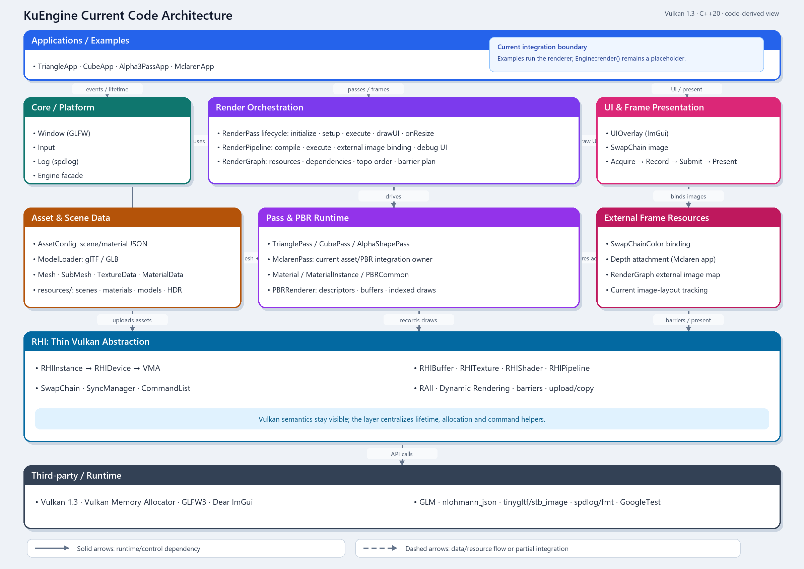

# 历史资料

这里保留迁移前的计划、发布记录和图示。它们可能与当前代码不一致；当前入口为 [宏观架构](../current-architecture.md) 和 [开发路线图](../roadmap.md)。

- [v0.2 执行计划](v0.2-execution-plan.md)：原 design 中的阶段任务与完成记录。
- [v0.2 发布说明](v0.2-alpha-release-notes.md)：原 usage 中的发布记录。
- [v0.2 回归流程](v0.2-regression-checks.md)：旧执行器检查方法。
- [原架构图片](kuengine-architecture.png)：原 PNG 内容完整保留，含迁移前 Engine/深度所有权描述。
- [未完成草稿](Structure_temp.md)：历史生成草稿。
- [Structure_725 PDF](Structure_725.pdf)、[Structure_726 PDF](Structure_726.pdf)：历史导出版本。
- 对应 Markdown 快照：[Structure_725](../Structure_725.md)、[Structure_726](../Structure_726.md)。

历史正文保留当时路径和术语；不要照搬其中的旧接口或回归指标到当前代码。

## 原架构图片（迁移前）

