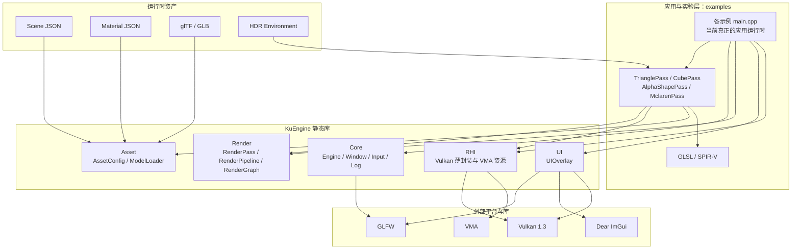
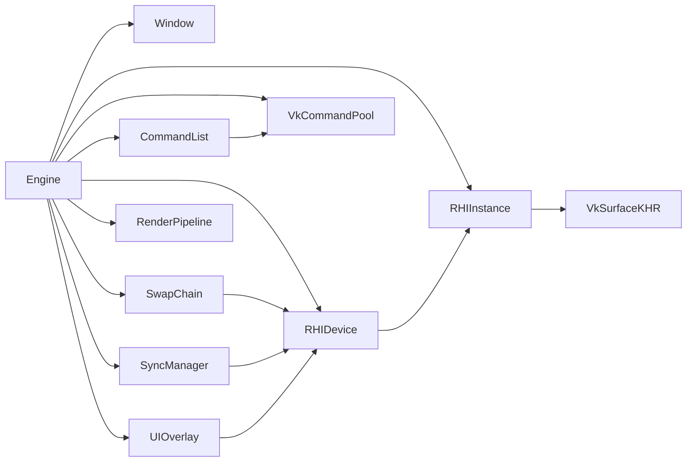
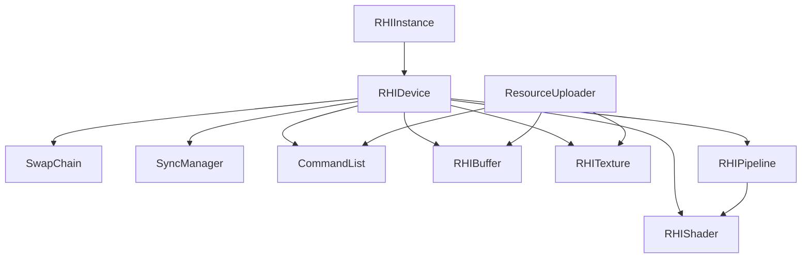
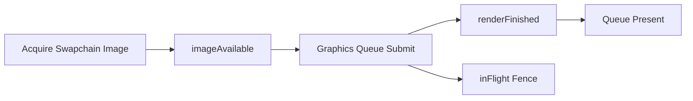

# KuEngine 现有代码架构分析

> 历史未完成草稿，仅用于追溯；当前架构见 [current-architecture.md](../current-architecture.md)。

> 文档日期：2026-07-25  
> 分析对象：当前仓库中的 `src/`、`examples/`、`resources/`、`tests/` 与 CMake 配置  
> 文档目标：还原**当前已经存在的代码架构**，同时标记早期实现中尚未收敛或值得优化的部分

---

## 1. 结论先行

KuEngine 当前是一个以 Vulkan 1.3 为基础、使用 C++20 编写的静态渲染框架。项目的封装思路比较清晰：

- `Core` 管理窗口、输入、日志以及一个尚未接通渲染的 `Engine` 外壳。
- `RHI` 对 Vulkan 实例、设备、交换链、命令、同步、缓冲、纹理、着色器和图形管线做薄封装。
- `Render` 提供 `RenderPass`、`RenderPipeline`、RenderGraph Alpha，以及初步的网格、纹理和 PBR 公共能力。
- `Asset` 负责 JSON 场景/材质配置与 glTF/GLB 的 CPU 侧加载。
- `UI` 封装 Dear ImGui 的 GLFW + Vulkan Dynamic Rendering 接入。
- `examples` 不只是演示代码，它们目前还承担了真正的应用运行时和逐帧调度职责。

最需要先记住的一点是：

> **当前“统一 Engine 运行时”与“实际可运行路径”并不是同一条路径。**

`Engine` 已经持有窗口、RHI、交换链、同步器、命令列表、UI 和渲染管线，但 `Engine::render()` 仍为空。Triangle、Cube、Alpha3Pass 和 Mclaren 四个示例各自在 `main.cpp` 中重复完成资源创建、帧循环、交换链重建、Dynamic Rendering、提交和呈现。

因此，当前项目更准确的定位是：

> 一套已经具备基本分层的 Vulkan 实验框架，加上一组各自拥有应用运行时的验证程序；统一运行时、完整 RenderGraph 资源管理和公共 PBR 资产链仍处于收敛过程。

---

## 2. 仓库组织

```text
KuEngine/
├── CMakeLists.txt
├── CMakePresets.json
├── vcpkg.json
├── src/
│   ├── CMakeLists.txt
│   └── KuEngine/
│       ├── KuEngine.h
│       ├── Core/
│       ├── RHI/
│       ├── Render/
│       ├── Asset/
│       └── UI/
├── examples/
│   ├── triangle/
│   ├── cube/
│   ├── alpha3pass/
│   └── mclaren/
├── resources/
│   ├── models/
│   ├── materials/
│   ├── scenes/
│   ├── environments/
│   ├── manifests/
│   └── shaders/
├── tests/
│   └── core/
└── docs/
    ├── design/
    ├── logs/
    ├── bugs/
    ├── usage/
    └── structure/
```

### 2.1 构建产物

| CMake 目标 | 类型 | 组成 | 当前职责 |
|---|---|---|---|
| `KuEngine` | 静态库 | `src/KuEngine/**` | 提供核心、RHI、Render、Asset、UI 公共代码 |
| `TriangleApp` | 可执行程序 | `examples/triangle` | 最小 Dynamic Rendering 与 push constant 验证 |
| `CubeApp` | 可执行程序 | `examples/cube` | 程序化立方体、相机矩阵和鼠标旋转验证 |
| `Alpha3PassApp` | 可执行程序 | `examples/alpha3pass` | 三 Pass 顺序、显式依赖和共享目标写入验证 |
| `MclarenApp` | 可执行程序 | `examples/mclaren` | glTF、材质、纹理、HDR、深度和 PBR 综合验证 |
| `test_core` | 测试程序 | `tests/core` | RenderGraph 与资产配置的 CPU 侧测试 |

### 2.2 主要第三方依赖

| 依赖 | 用途 |
|---|---|
| Vulkan | 图形 API |
| Vulkan Memory Allocator | Buffer/Image 内存分配 |
| GLFW | 窗口、Surface 和输入 |
| Dear ImGui | 调试与参数调节 UI |
| spdlog / fmt | 日志和格式化 |
| GLM | 向量、矩阵和相机计算 |
| nlohmann-json | 场景和材质 JSON 解析 |
| tinygltf + stb_image | glTF/GLB、图片与 HDR 加载 |
| GoogleTest | 单元测试 |

当前 `KuEngine` 将大部分依赖声明为 `PUBLIC`，因而示例可直接获得相关 include 与链接依赖。这简化了早期开发，但也扩大了库的公共依赖面。
---

## 3. 总体分层


### 3.1 分层并非严格单向

现有代码总体上遵循“应用 → Render/Asset → RHI”的方向，但还不是严格的层级架构：

- `Core::Engine` 直接聚合 RHI、UI 和 Render。
- `RenderPipeline.cpp` 直接依赖 ImGui，用于绘制 RenderGraph Debug 面板。
- `PBRCommon` 同时依赖 Asset 数据结构和 Vulkan 类型。
- `MclarenPass` 同时承担应用逻辑、资产解析编排、GPU 上传、描述符创建、管线创建、PBR 参数转换与 UI。
- 示例 `main.cpp` 直接调用 Vulkan 命令，绕过部分 RHI。

这与项目的早期状态一致：公共抽象已经出现，但职责仍在从示例代码向库内迁移。

---

## 4. 两套运行时形态

## 4.1 `Engine` 所表达的目标形态

`Core/Engine` 的成员已经表达了一个统一 Runtime 的雏形：


构造顺序为：

1. 初始化日志。
2. 创建 `Window`。
3. 创建 `RHIInstance`。
4. 创建 `VkSurfaceKHR`。
5. 选择物理设备并创建 `RHIDevice`。
6. 创建命令池。
7. 创建交换链。
8. 创建同步对象。
9. 分配命令列表。
10. 初始化 ImGui。
11. 创建 `RenderPipeline`。

析构时显式执行相反方向：

1. `device.waitIdle()`。
2. 销毁 RenderPipeline 和 Pass。
3. 销毁 UI、命令列表、同步器、交换链。
4. 销毁命令池。
5. 销毁 Device。
6. 销毁 Surface。
7. 销毁 Instance 和 Window。

这个顺序基本满足 Vulkan 对父子对象生命周期的要求。

但是，`Engine::render()` 当前为空，`m_currentFrame`、`m_minimized` 等字段也没有进入实际帧调度。因此 `Engine::run()` 目前只会轮询事件和休眠，不会输出图形。

## 4.2 示例采用的实际形态

四个示例采用栈对象和嵌套作用域，手工保证析构顺序：

```text
Window
└── RHIInstance
    └── VkSurfaceKHR
        └── RHIDevice
            ├── VkCommandPool
            ├── SwapChain
            ├── SyncManager
            ├── CommandList
            ├── UIOverlay
            ├── RenderPipeline
            │   └── RenderPass 实例
            └── 示例特有资源（如 DepthTexture）
```

示例退出内层作用域后，先销毁所有依赖 Device 的对象，再销毁命令池和 Device，最后销毁 Surface。这是当前真正经过运行代码使用的生命周期路径。

### 现状评价

- 优点：生命周期顺序直观，便于快速定位 Vulkan 初始化和资源释放问题。
- 问题：Triangle、Cube、Alpha3Pass、Mclaren 的帧循环高度重复。
- 结果：交换链恢复、同步、布局追踪或 UI 调度的修复必须在多个示例中同步修改。

---

## 5. Core 模块

## 5.1 `Window`

`Window` 封装：

- GLFW 初始化和终止。
- Vulkan 无客户端 API 窗口创建。
- Framebuffer Resize 回调。
- Close 回调。
- GLFW 原生句柄访问。

它使用文件内全局计数 `g_glfwWindowCount`，在第一个窗口创建时调用 `glfwInit()`，最后一个窗口销毁时调用 `glfwTerminate()`。

当前注意点：

- Resize 回调只设置 `m_resized` 和 `m_minimized`，没有更新 `m_width`、`m_height`。
- `swapBuffers()` 对 Vulkan 窗口没有实际用途，属于 OpenGL 风格残留。
- 多线程和多个窗口同时创建/销毁时，全局计数没有同步保护。

## 5.2 `Input`

`Input` 是全静态状态容器：

- 保存键盘当前状态与“本帧按下”状态。
- 保存鼠标按钮状态。
- 计算鼠标位置和逐帧 delta。
- 通过当前 GLFW Context 设置鼠标位置。

当前示例没有统一使用它。Cube 和 Mclaren 在 `main.cpp` 内直接调用 GLFW 处理鼠标拖拽，说明输入抽象还没有真正成为公共运行时的一部分。

## 5.3 `Log`

`Log` 对 spdlog 做轻量封装：

- 只创建名为 `KuEngine` 的彩色控制台 logger。
- Debug 构建启用 debug level，Release 使用 info level。
- 对外提供 `KU_TRACE` 到 `KU_CRITICAL` 宏。

## 5.4 `Engine`

`Engine` 是当前架构中最明显的“目标接口已存在、实现尚未接通”的模块：

- 已经拥有绝大部分运行时对象。
- 已经有事件循环和时间统计。
- `render()` 为空。
- 尚未提供示例注册 Pass、深度附件、交换链恢复或多帧命令资源的完整路径。

因此不应把 `Engine` 当作当前示例的基类或实际入口；它更接近下一阶段统一 Runtime 的骨架。

---

## 6. RHI 模块

RHI 的总体原则是保留 Vulkan 语义，只消除创建、销毁和常见命令的样板代码。



## 6.1 类职责表

| 类 | 持有的主要对象 | 主要职责 |
|---|---|---|
| `RHIInstance` | `VkInstance` | 创建 Vulkan 1.3 Instance，Debug 构建启用 Validation Layer，创建 Surface |
| `RHIDevice` | PhysicalDevice、Device、Queue、VMA | 选择 GPU、创建逻辑设备、图形/呈现队列和 VMA |
| `SwapChain` | Swapchain、Images、ImageViews | 选择格式/呈现模式/尺寸，获取下一图像，重建交换链 |
| `SyncManager` | 每帧两个 Semaphore 和一个 Fence | 等待帧、提交命令、呈现、推进 frame index |
| `CommandList` | 一个 Primary CommandBuffer | begin/end、Image Barrier、Buffer Copy、Buffer-to-Image Copy |
| `RHIBuffer` | `VkBuffer` + `VmaAllocation` | 创建、映射、刷新和释放缓冲 |
| `RHITexture` | `VkImage` + Allocation + ImageView | 创建和释放单层、单 mip 2D 图像 |
| `RHIShader` | `VkShaderModule` | 从 SPIR-V 文件创建 Shader Module |
| `RHIPipeline` | Pipeline + PipelineLayout | 创建两阶段图形管线，使用 Dynamic Rendering |
| `ResourceUploader` | 独立 CommandPool | 通过 staging buffer 即时上传 Buffer 或 Texture |

## 6.2 Instance 与设备初始化

`RHIInstance`：

- 请求 `VK_API_VERSION_1_3`。
- 从 GLFW 获得所需 Instance Extension。
- Debug 构建直接启用 `VK_LAYER_KHRONOS_validation`。
- 没有创建 Debug Messenger。

`RHIDevice`：

- 优先选择第一个离散 GPU，否则选择第一个枚举设备。
- 分别寻找第一个 Graphics Queue Family 和第一个 Present Queue Family。
- 启用 `VK_KHR_swapchain`。
- 通过 `VkPhysicalDeviceVulkan13Features` 启用 Dynamic Rendering 与 Synchronization2。
- 创建 VMA Allocator。

当前选择逻辑是“设备类型优先”，还没有完整的 suitability scoring。它没有在选择前验证：

- Vulkan 1.3 和所需 Feature 是否真实支持。
- `VK_KHR_swapchain` 是否存在。
- Surface Format 和 Present Mode 是否可用。
- 被选中的离散 GPU 是否拥有合法的 Present Queue。

如果没有找到 Present Queue，代码会回退到 Graphics Queue Family，但没有再次确认该队列真的支持呈现。

## 6.3 交换链

交换链策略：

- 优先 `VK_FORMAT_B8G8R8A8_UNORM + SRGB_NONLINEAR`。
- 优先 `MAILBOX`，否则 `FIFO`。
- 图像数为 `minImageCount + 1`，受 `maxImageCount` 限制。
- 图形/呈现队列不同则使用 Concurrent Sharing，否则 Exclusive。
- 图像用途目前只有 `COLOR_ATTACHMENT`。

`recreate()` 采用最直接的恢复策略：

1. `device.waitIdle()`。
2. 销毁所有 ImageView 和旧 Swapchain。
3. 创建新 Swapchain 和 ImageView。

它没有使用 `oldSwapchain`，也没有延迟销毁，因此重建简单但会造成全设备停顿。

## 6.4 同步模型

每个 `FrameSync` 包含：

```text
imageAvailable Semaphore
renderFinished Semaphore
inFlight Fence
```

提交关系为：



四个示例都创建 `SyncManager(device, 1)`，所以当前实际是单帧在途。`Engine` 则按两个 frame-in-flight 创建同步器，但 Engine 的渲染尚未实现。

## 6.5 命令与 Barrier

`CommandList` 使用 Vulkan 旧版 `vkCmdPipelineBarrier`，尚未使用已经启用的 Synchronization2。

支持的布局到 Access Mask 映射主要覆盖：

- Color Attachment
- Shader Read
- Transfer Source / Destination
- General
- Present / Undefined

当前缺少 Depth Attachment 等布局的 Access Mask 映射。Mclaren 深度纹理从 `UNDEFINED` 转换到 `DEPTH_ATTACHMENT_OPTIMAL` 时，目标 Access Mask 会落到默认值 0，虽然指定了 Early Fragment Tests Stage，但同步语义并不完整。

此外，当前 Image Barrier 固定操作：

- mip level 0，数量 1。
- array layer 0，数量 1。
- 不处理 Queue Family Ownership Transfer。

这与当前所有纹理均为单 mip、单 layer 2D 图像的实现相匹配，但不适用于后续 cubemap、mipmap 或纹理数组。

## 6.6 GPU 资源

`RHIBuffer` 与 `RHITexture` 使用 VMA：

- Buffer 可配置 usage、memory usage 和 allocation flags。
- Texture 固定为 2D、单 mip、单 layer、Optimal Tiling。
- `TextureFactory` 为采样纹理添加 `TRANSFER_DST | SAMPLED`。

`ResourceUploader` 每次上传时：

1. 创建一个 staging buffer。
2. Map、memcpy、flush、unmap。
3. 从上传器自己的 CommandPool 分配一个新 CommandList。
4. 记录 copy 和布局转换。
5. `vkQueueSubmit()`。
6. `vkQueueWaitIdle()`。

这种方式实现简单且容易验证，但每个 Buffer/Texture 都会单独阻塞 Graphics Queue。Mclaren 为多份材质纹理逐一执行此流程，加载成本会随纹理数量线性累积。上传 CommandBuffer 也直到上传器的 CommandPool 销毁才统一释放。

## 6.7 图形管线

`RHIPipeline` 当前是专门的 Graphics Pipeline 封装：

- 固定将 shader 数组的前两个元素解释为 Vertex 和 Fragment。
- 使用 Dynamic Rendering，不创建传统 `VkRenderPass`。
- Viewport 和 Scissor 为动态状态。
- 支持顶点输入、Descriptor Set Layout 和 Push Constant Range。
- 支持一个统一的 depth test/write、cull、front face 和 blend 开关。

它没有覆盖：

- Compute Pipeline。
- Geometry/Tessellation 等额外 Shader Stage。
- Pipeline Cache。
- 独立的多附件混合状态。
- Polygon Mode、Depth Compare Op 等更完整的可配置状态。

当 `colorFormats` 为空时，管线默认使用 `B8G8R8A8_UNORM`。各示例也硬编码相同格式，而不是从实际 SwapChain 传入格式。

---

## 7. Render 模块

## 7.1 `RenderPass`

`RenderPass` 是算法验证单元的核心接口：

```cpp
class RenderPass {
public:
    virtual std::string_view name() const = 0;
    virtual void initialize(RHIDevice& device);
    virtual void setup(RenderGraphBuilder& builder);
    virtual void execute(CommandList& cmd, const FrameData& frame);
    virtual void drawUI();
    virtual void onResize(uint32_t width, uint32_t height);
};
```
