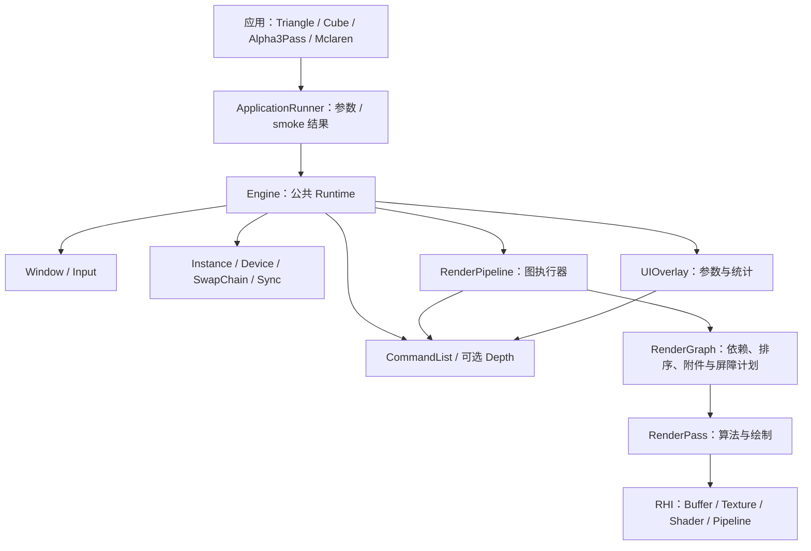
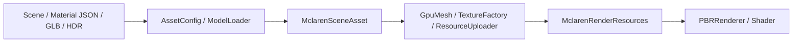

# KuEngine 当前宏观架构

核对日期：2026-09-13。基于当前工作区源码，包括尚未提交的绘制数量与 CPU/GPU 统计及已验收的 Validation 诊断基础。

## 定位与当前能力

KuEngine 是基于 Vulkan 1.3 的图形算法验证框架。当前由一个公共 Runtime 承载四个示例，具备 Pass 调度、图像附件执行、glTF/PBR 输入、UI 参数控制与基础性能观测。

CMake/版本宏仍标为 0.1.0；历史文档中的 v0.2/v0.3 是迭代阶段称谓，本页不据此宣布新版本发布。

## 运行结构

Runtime 拥有公共生命周期；RenderPipeline 拥有 Pass 并执行 Graph；外部交换链/深度图像由 Engine 绑定。每个有附件的 Pass 使用独立 Dynamic Rendering Scope，屏障在 Scope 外记录。UI 由尾部特殊 Scope 绘制。

## 数据与资源流

MclarenPass 组合场景、相机和资源容器；Skybox 与 PBR 仍在一个 Graph 节点中。PBR 的 per-draw UBO 按设备对齐要求独立存放，通过 dynamicOffset 绑定。

## 可观测性

FPS/Frame 来自主循环，Draw Calls/Vertices 来自当前命令记录，CPU 来自 acquire 后至 submit 返回的计时，GPU 来自 Fence 后读回的两个 Timestamp。CPU/GPU 显示最近完成帧。Debug 构建中，Instance 仅在 Validation Layer 和 Debug Utils 可用时捕获 Vulkan 回调并写入统一日志；共享 Tracker 的 warning/error 累计值可跨 Instance 销毁读取，ApplicationRunner 会将非零 error 映射为失败退出码。显式 smoke 模式额外要求可捕获 Validation，并将缺少驱动、设备、Layer 或 Debug Utils 报告为 skip；这些计数仍不显示在 UI。Graph Debug UI 展示依赖、屏障和执行摘要。

这提供单帧量级的观测；尚无性能曲线、每 Pass Query、结果导出或可复现实验框架。具体统计口径见 [UI 设计](../design/05-ui-layer.md)。

## 已实现与现有限制

| 领域 | 当前实现 | 当前限制 |
|---|---|---|
| Runtime | 四示例统一帧循环、可选深度、按提交帧数停止、自动 resize 结果 | 单帧并行；重建使用 deviceWaitIdle，最小化/恢复未纳入自动 smoke |
| Graph | 依赖编译、实际 Image Barrier、Scope 与附件有效性检查 | 不分配内部资源，无 Buffer Barrier/别名/多 Queue |
| RHI | Vulkan/VMA 薄封装、同步上传、动态渲染、可用性检测后的 Validation/Debug Utils 消息记录 | 旧式 Barrier，上传 queueWaitIdle，无 Compute Pipeline |
| PBR/资产 | glTF、贴图、TBN、emissive、动态 UBO、HDR | 独立 AO/MR、emissive UV、逐节点材质/变换仍有限制 |
| UI | ImGui 参数、Graph 调试、数量和时间 | 单 Context；UI 非普通 Graph Pass |
| 测试 | CPU 单测；可选 CTest GPU Smoke：四示例有限帧、Triangle resize、Validation/初始化负例 | 不是截图/像素回归；依赖 Vulkan、窗口、Debug Layer/Debug Utils 的环境检查 |

## 源码和测试组织

公共库在 src/KuEngine，下分 Core、RHI、Render、Asset、UI；示例在 examples 的四个子目录，资源在 resources。

CTest 的 core_tests 覆盖 tests/core 中的 Engine/Graph/AssetConfig/ApplicationRunner/PBR/Validation，mclaren_camera_tests 覆盖 OrbitCameraController。启用 `KUENGINE_ENABLE_GPU_SMOKE_TESTS` 后，GPU Smoke 还覆盖四个应用的有限帧运行、Triangle resize、受控 Validation error 与缺 Shader 初始化失败。使用步骤见 [当前回归指南](../usage/regression-checks.md)。

GPU Smoke 是启动、提交、退出、有限 resize 和诊断结果的自动化检查；它不验证人工画面、交互、最小化/恢复或像素正确性。未来目标单独维护在 [路线图](roadmap.md)。
