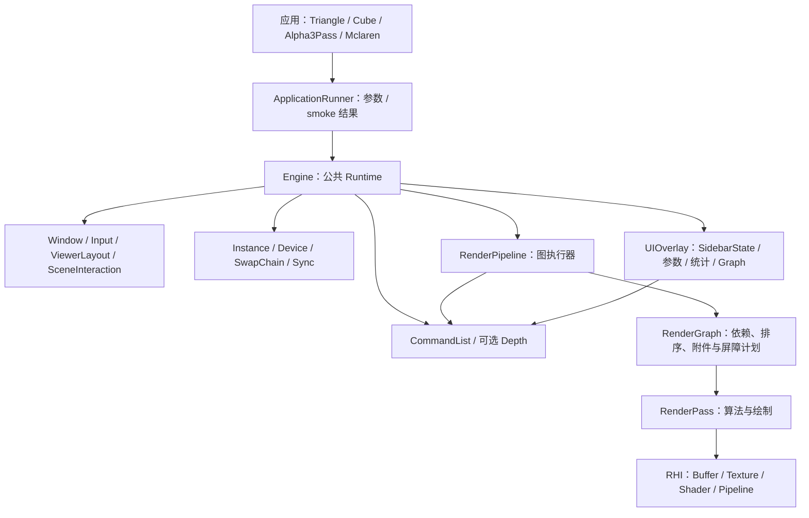
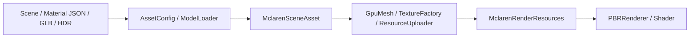

# KuEngine 当前宏观架构

核对日期：2026-09-14。基于已验收的 M0、M1：Validation 诊断、GPU Smoke、completed-submit 性能统计、统一侧栏、查看器输入/视口边界与 Mclaren 双模式相机。

## 定位与当前能力

KuEngine 是基于 Vulkan 1.3 的图形算法验证框架。当前由一个公共 Runtime 承载四个示例，具备 Pass 调度、图像附件执行、glTF/PBR 输入、UI 参数控制与基础性能观测。

CMake/版本宏仍标为 0.1.0；历史文档中的 v0.2/v0.3 是迭代阶段称谓，本页不据此宣布新版本发布。

## 运行结构

Runtime 拥有公共生命周期；RenderPipeline 拥有 Pass 并执行 Graph；外部交换链/深度图像由 Engine 绑定。每个有附件的 Pass 使用独立 Dynamic Rendering Scope，屏障在 Scope 外记录。Engine 每帧将侧栏快照转成 `ViewerLayout`：展开侧栏保留右侧宽度，紧凑/重开模式覆盖场景；逻辑输入矩形和 framebuffer viewport 一同传给 Pass。业务 Scope 的 renderArea 覆盖完整附件、viewport/scissor 限制为场景，尾部 UI Scope 则绘制完整附件。

## 数据与资源流

MclarenPass 组合场景、示例层双模式相机和资源容器；Skybox 与 PBR 仍在一个 Graph 节点中。`OrbitCameraController` 输出统一 `CameraFrame`：OrbitInspect 保留模型旋转/滚轮查看，FreeFly 通过右键场景焦点驱动 WASDQE；切换时以当前帧双向交接并要求中性输入。PBR 的 per-draw UBO 按设备对齐要求独立存放，通过 dynamicOffset 绑定。

## 查看器与可观测性

UIOverlay 是唯一顶层右侧栏，展开态包含 Performance、Parameters / Scene、Render Graph；收起后可显示紧凑 Performance，隐藏后仍有重开控件。Pass 只输出内容，Pipeline 用 Pass 索引隔离 ImGui ID。侧栏状态变更在下一帧快照生效，避免单帧中 UI、渲染和输入看到不同布局。`SceneInteractionGate` 以活动窗口、ImGui 捕获、场景逻辑矩形、覆盖 UI 排除和 Input epoch 控制拖动/滚轮；Cube 和 Mclaren 共享它，比例也取同一场景 viewport。Mclaren 已移除第二套局部视口；FreeFly 进一步以 UI 键盘/文本捕获、场景右键焦点与 held-input neutral 规则隔离 WASDQE，Cube 不接入该模式。

FPS/Frame 来自当前主循环；CPU、GPU、Draw Calls、Vertices 来自同一个已完成 submitted frame。Engine 在 submit 后暂存 CPU 与业务计数，Fence 完成或退出 device idle 后结合 Timestamp 发布快照。GPU 状态分为 Unsupported、Waiting、Available；Draw/Vertices 使用饱和 `uint64_t` 累加。Debug 构建中，Instance 仅在 Validation Layer 和 Debug Utils 可用时捕获 Vulkan 回调并写入统一日志；共享 Tracker 的 warning/error 累计值可跨 Instance 销毁读取，ApplicationRunner 会将非零 error 映射为失败退出码。显式 smoke 模式额外要求可捕获 Validation，并将缺少驱动、设备、Layer 或 Debug Utils 报告为 skip；这些计数仍不显示在 UI。Graph Debug UI 展示依赖、屏障和执行摘要。

这提供单帧量级的观测；尚无性能曲线、每 Pass Query、结果导出或可复现实验框架。具体统计口径见 [UI 设计](../design/05-ui-layer.md)。

## 已实现与现有限制

| 领域 | 当前实现 | 当前限制 |
|---|---|---|
| Runtime | 四示例统一帧循环、可选深度、按提交帧数停止、自动 resize、completed-submit 统计 | 单帧并行；重建使用 deviceWaitIdle，最小化/恢复未纳入自动 smoke |
| Graph | 依赖编译、实际 Image Barrier、Scope 与附件有效性检查 | 不分配内部资源，无 Buffer Barrier/别名/多 Queue |
| RHI | Vulkan/VMA 薄封装、同步上传、动态渲染、可用性检测后的 Validation/Debug Utils 消息记录 | 旧式 Barrier，上传 queueWaitIdle，无 Compute Pipeline；部分同步 wait 返回值尚未统一检查 |
| PBR/资产 | glTF、贴图、TBN、emissive、动态 UBO、HDR | 独立 AO/MR、emissive UV、逐节点材质/变换仍有限制 |
| UI / 查看器 | 唯一右侧栏、参数/Graph/统计、逻辑输入矩形和 framebuffer 场景 viewport；Mclaren OrbitInspect/FreeFly | 单 Context；UI 非普通 Graph Pass；FreeFly 仍为示例层，Cube 未接入，尚无多窗口 |
| 测试 | CPU 单测；可选 CTest GPU Smoke：四示例有限帧、Triangle resize、Validation/初始化负例与预期业务计数比较 | 不是截图/像素回归；依赖 Vulkan、窗口、Debug Layer/Debug Utils 的环境检查 |

## 源码和测试组织

公共库在 src/KuEngine，下分 Core、RHI、Render、Asset、UI；示例在 examples 的四个子目录，资源在 resources。

CTest 的 core_tests 覆盖 tests/core 中的 Engine/FrameStatistics/Graph/AssetConfig/ApplicationRunner/PBR/Validation、SidebarState、ViewerLayout 和 SceneInteraction，mclaren_camera_tests 覆盖双模式 `OrbitCameraController` 的 handoff、六向输入、归一化、epoch、capture、neutral 和 reset 契约。启用 `KUENGINE_ENABLE_GPU_SMOKE_TESTS` 后，GPU Smoke 还覆盖四个应用的有限帧运行、Triangle resize、受控 Validation error、缺 Shader 初始化失败、completed-submit 业务计数和收起侧栏布局。QA 在 RTX 4060 Ti Debug 环境验证了四例唯一侧栏、收起/紧凑/隐藏/重开、小窗口滚动、Alpha 控件隔离、Mclaren 分组、展开/收起比例和无黑缝，以及 Cube 滚轮/UI 隔离、最小化/恢复、resize 与无 Validation error；还确认 Mclaren 两向切换无跳变、文本输入不移动、reset、折叠/重开与最大化/最小化。持续右键拖动、WASDQE 六向与组合 held 手势尚无可靠实机手势证据，只由永久测试和静态覆盖支持；没有 Win+D、物理非等比 DPI 或像素参考图比对证据。

GPU Smoke 是启动、提交、退出、有限 resize 和诊断结果的自动化检查；它不验证人工画面、交互、最小化/恢复或像素正确性。未来目标单独维护在 [路线图](roadmap.md)。

Release 并行构建仍存在同名 Shader 复制竞态；该风险及未统一检查的同步 wait 返回值未在 M0 修复。
