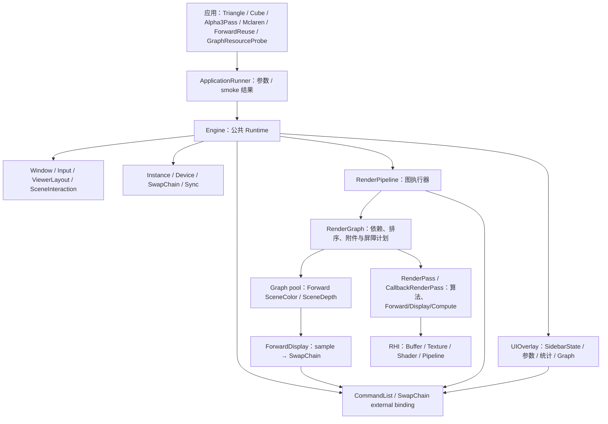
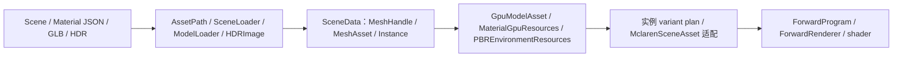

# KuEngine 当前宏观架构

核对日期：2026-10-07。基于已验收的 M0、M1、M2、M3-WP01～04：typed Graph 资源、内部池、生命周期、synchronization2、Compute/callback/native access 与 Forward Graph output/display。

## 定位与当前能力

KuEngine 是基于 Vulkan 1.3 的图形算法验证框架。当前由一个公共 Runtime 承载六个示例，具备 Pass/Callback 调度、图像附件执行、Graphics/Compute 图资源、glTF/PBR 输入、UI 参数控制与基础性能观测。

CMake/版本宏仍标为 0.1.0；历史文档中的 v0.2/v0.3 是迭代阶段称谓，本页不据此宣布新版本发布。

## 运行结构

Runtime 拥有公共生命周期；RenderPipeline 拥有 Pass、Graph 与 internal resource pool 并执行 Graph。Engine 只绑定外部 SwapChainColor；ForwardSceneColor/ForwardSceneDepth 是 Pipeline pool 的内部目标，Engine 不拥有 RuntimeDepth。每个有附件的 Pass 使用独立 Dynamic Rendering Scope，屏障在 Scope 外记录。Engine 每帧将侧栏快照转成 `ViewerLayout`：展开侧栏保留右侧宽度，紧凑/重开模式覆盖场景；逻辑输入矩形和 framebuffer viewport 一同传给 Pass。业务 Scope 的 renderArea 覆盖完整附件、viewport/scissor 限制为场景，尾部 UI Scope 则绘制完整附件。

## 数据与资源流

AssetPath 将相对资产引用解析为规范路径；SceneLoader 将去重 MeshAsset 和含 TRS/material override 的 SceneInstance 以稳定 MeshHandle 连接，完整候选校验成功后才发布。HDRImageLoader 提供严格校验的 CPU RGBA float 环境输入。公共 Forward 按 handle 上传 mesh，按真实 descriptor 差异建立材质 variant；`ForwardProgram` 拥有固定 set layout、shader 和有限 pipeline cache，`ForwardRenderer` 拥有 frame/draw UBO 和 descriptor。Mclaren 与 ForwardReuse 都使用它；旧 Mclaren renderer 文件未构建/运行。Mclaren UI/CLI 可入队模型或 HDR 替换；单帧 Fence-safe update 点同步构建候选，成功交换并递增相应 generation，失败保留 live state、相机和统计。Skybox 与 PBR 仍在一个 Graph 节点中。`OrbitCameraController` 输出统一 `CameraFrame`：OrbitInspect 保留模型旋转/滚轮查看，FreeFly 通过右键场景焦点驱动 WASDQE；切换时以当前帧双向交接并要求中性输入。

## 查看器与可观测性

UIOverlay 是唯一顶层右侧栏，展开态包含 Performance、Parameters / Scene、Render Graph；收起后可显示紧凑 Performance，隐藏后仍有重开控件。Pass 只输出内容，Pipeline 用 Pass 索引隔离 ImGui ID。侧栏状态变更在下一帧快照生效，避免单帧中 UI、渲染和输入看到不同布局。`SceneInteractionGate` 以活动窗口、ImGui 捕获、场景逻辑矩形、覆盖 UI 排除和 Input epoch 控制拖动/滚轮；Cube 和 Mclaren 共享它，比例也取同一场景 viewport。Mclaren 已移除第二套局部视口；FreeFly 进一步以 UI 键盘/文本捕获、场景右键焦点与 held-input neutral 规则隔离 WASDQE，Cube 不接入该模式。

FPS/Frame 来自当前主循环；CPU、GPU、Draw Calls、Vertices 来自同一个已完成 submitted frame。Engine 在 submit 后暂存 CPU 与业务计数，Fence 完成或退出 device idle 后结合 Timestamp 发布快照。GPU 状态分为 Unsupported、Waiting、Available；Draw/Vertices 使用饱和 `uint64_t` 累加。Debug 构建中，Instance 仅在 Validation Layer 和 Debug Utils 可用时捕获 Vulkan 回调并写入统一日志；共享 Tracker 的 warning/error 累计值可跨 Instance 销毁读取，ApplicationRunner 会将非零 error 映射为失败退出码。显式 smoke 模式额外要求可捕获 Validation，并将缺少驱动、设备、Layer 或 Debug Utils 报告为 skip；这些计数仍不显示在 UI。Graph Debug UI 展示依赖、屏障和执行摘要。

这提供单帧量级的观测；尚无性能曲线、每 Pass Query、结果导出或可复现实验框架。具体统计口径见 [UI 设计](../design/05-ui-layer.md)。

## 已实现与现有限制

| 领域 | 当前实现 | 当前限制 |
|---|---|---|
| Runtime | 六示例统一帧循环、深度 format 选择、按提交帧数停止、自动 resize/recompile、completed-submit 统计 | 单帧并行；重建使用 deviceWaitIdle，最小化/恢复未纳入自动 smoke |
| Graph | typed Image/Buffer descriptor/handle、internal pool、candidate compile/resize、first-use/LOAD/export、显式 use、CPU state planner、synchronization2 image/buffer barrier、Compute callback/checked resolver/受约束 native scope、Forward SceneColor/Depth/display | 无别名/多 Queue；内部内容不跨帧保留；不自动检测任意裸 Vulkan 命令 |
| RHI | Vulkan/VMA 薄封装、同步上传、动态渲染、显式 ShaderDesc、Compute Pipeline/ParameterSet、可用性检测后的 Validation/Debug Utils 消息记录 | 旧式 Barrier 仍有兼容入口，上传 queueWaitIdle，无 Async Compute；部分同步 wait 返回值尚未统一检查 |
| Forward/资产 | glTF、五类材质贴图/UV、TBN、PBR/Unlit、Opaque/Mask/Blend、最多四点光、基础环境；公共 Forward 写 Graph-owned SceneColor/Depth，Display sampled→SwapChain→Overlay→Present | 无完整 IBL/OIT/线性 HDR 统一输出/Deferred；无异步/跨场景缓存或多帧 retire |
| UI / 查看器 | 唯一右侧栏、参数/Graph/统计、逻辑输入矩形和 framebuffer 场景 viewport；Mclaren OrbitInspect/FreeFly | 单 Context；UI 非普通 Graph Pass；FreeFly 仍为示例层，Cube 未接入，尚无多窗口 |
| 测试 | CPU 单测；可选 CTest GPU Smoke：四示例有限帧、Triangle resize、Validation/初始化负例与预期业务计数比较 | 不是截图/像素回归；依赖 Vulkan、窗口、Debug Layer/Debug Utils 的环境检查 |

## 源码和测试组织

公共库在 src/KuEngine，下分 Core、RHI、Render、Asset、UI；示例在 examples 的六个子目录，资源在 resources。

CTest 的 core_tests 覆盖 Engine/FrameStatistics/Graph/AssetConfig/ApplicationRunner/PBR/Validation、SidebarState、ViewerLayout、SceneInteraction、Scene/AssetPath/HDR/PBR 资产计划、Mclaren replacement、Graph state/Callback 与 Forward Graph targets CPU 语义；mclaren_camera_tests 覆盖双模式 `OrbitCameraController`。M3-WP04 QA 在独立 Debug/Release 构建中通过 Debug core124/camera32/定向37、完整 CTest19/19，以及 SyncVal 下 ForwardReuse 二次 compile 9/45、Probe 二次 compile 后 resize 1/3、Mclaren resize 91/9,202,884，均 errors=0；权威 Release CTest 为 3 Passed / 16 Skipped / 0 Failed。Release direct 的 ForwardReuse、Probe 二次 compile、Mclaren、Triangle 另行通过；require-validation/缺 Layer 的 77 是预期 skip。没有 RenderDoc、readback pixel baseline、soak、真实 live-format 强制或物理非等比 DPI 证据。

GPU Smoke 是启动、提交、退出、有限 resize 和诊断结果的自动化检查；它不验证人工画面、交互、最小化/恢复或像素正确性。未来目标单独维护在 [路线图](roadmap.md)。

Release 并行构建仍存在同名 Shader 复制竞态；该风险及未统一检查的同步 wait 返回值未在 M0 修复。
