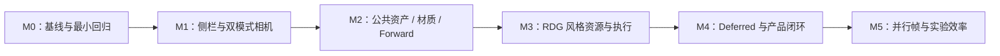

# KuEngine 开发路线图

更新日期：2026-09-13。本路线以“小型 Vulkan 渲染引擎，服务渲染特性的快速开发与验证”为目标，替代原先以底层补强为主的任务排序。不预设发布日期，M0～M5 是工作阶段，不是软件发布版本。

需求范围和状态统一维护在 [产品需求](product-requirements.md)，架构边界见 [目标架构](target-architecture.md)，当前已实现内容见 [宏观架构](current-architecture.md)。本轮只完成规划，以下阶段均未开始按新验收口径交付；已有能力作为基础，不重新计作新增功能。

## 1. 最终交付形态

一个可导入模型/HDR、切换 PBR/Unlit 和 Forward/Deferred、通过侧栏与双模式相机观察场景的小型渲染查看器；一个可被其他实验复用的公共引擎库；一组演示 Graph 资源、Graphics/Compute 和 Vulkan 原生扩展入口的精简示例。

“查看器”是引擎的验证应用，不是完整编辑器。新的渲染特性能够接入公共资源与图调度，无需复制设备、Swapchain、帧循环和通用同步代码。

## 2. 开发顺序与依赖

这是建议交付顺序，不是所有任务的硬依赖：M1 的相机/侧栏不依赖多帧并行；M2 的 CPU 资产语义与 M3 的状态设计可以独立推进；M4 的延迟渲染必须依赖 M2 的统一材质和 M3 的真实中间资源管理。正确性测试跟随每阶段，不集中拖到 M5。

| 阶段 | 主要交付 | 对应需求 | 阶段出口 |
|---|---|---|---|
| M0 | 可重复基线与最小 GPU 诊断 | REQ-07、14 | 四示例和现有统计可重复检查，验证结果有依据 |
| M1 | 查看器交互框架 | REQ-07～10 | 侧栏收展、双相机、输入焦点正确；现有参数可调 |
| M2 | 公共资产、材质、环境和前向路径 | REQ-01～05、08 | 换模型/HDR，独立实例材质，PBR/Unlit 共用 Forward |
| M3 | Graph 管理资源、同步与执行 | REQ-01、05、11～13 | 离屏 → 采样与 Compute → Graphics 真实运行 |
| M4 | 延迟路径与首个完整产品闭环 | REQ-04、06、13 | 同场景切换路径，材质语义一致，透明/输出/UI 完整 |
| M5 | 资源并行与实验效率强化 | REQ-14 | 按帧资源安全，性能观测与结果复现更完整 |

M4 完成后按 REQ-01～13 的验收口径进行整体检查，形成首个功能完整基线；M5 不应阻塞此前的可用版本。

## 3. 各阶段工作包

### M0：保住现有能力，建立最小验证基线

范围：Core、RHI 诊断、统计、tests、usage。保持现有单帧模式。

- 固定四示例的构建/CTest/运行操作与测试资源；记录当前画面、拖动交互及性能统计口径。
- 接入可收集 Validation 错误的诊断通路，建立有限帧数运行、正常退出与 resize 的最小 GPU 冒烟检查。验证层/设备不可用时明确记为跳过，而非通过。
- 核对 CPU 计时使用单调时钟的需求、CPU/GPU 样本帧归属、Timestamp 有效性和无数据状态；先消除影响后续比较的歧义，不在这里建设完整 Profiler。

验收：CPU 测试可执行；在有 Vulkan 环境的机器上，四示例可启动、绘制、退出，并检查窗口重建。Validation 错误被明确报告，脚本化检查能返回失败。现有指标没有被规划性改动破坏。

### M1：可折叠侧栏与双模式相机

范围：UIOverlay、Core/Input、示例相机与 Mclaren 装配。先复用现有场景，不等待资产层重构。

- 建立统一侧栏容器，分组放置场景、材质、相机、灯光、环境、统计与 Graph 调试内容；先挂接当前已有参数，缺少的数据模型由 M2 补齐。
- 明确主视口矩形，联动投影、Viewport/Scissor 和输入命中；可以直接绘制到交换链子区域，首轮不强制依赖离屏 UI 纹理。
- 保留当前拖动查看控制器，增加自由摄像机控制器和统一的相机帧数据输出；WASDQE 漫游、右键转向、速度调节、复位与模式切换。
- UI 捕获键鼠、输入框编辑、失焦、拖动结束和 resize 必须正确处理。侧栏收起时保留可选紧凑统计显示。

验收：两种模式可切换；拖动旧场景体验保留；输入文字不触发相机移动；不同帧率下漫游速度近似一致。侧栏收展、窗口缩放后视口比例与输入区域正确，既有性能指标仍可查看。

### M2：公共资产、材质与前向渲染

范围：Asset、Render/Material、GpuMesh/TextureFactory、公共环境资源、MclarenRenderResources、Viewer。

- 从 Mclaren 抽出轻量场景数据和通用 Mesh/Texture/材质/环境持有逻辑；保留示例装配，不只给大资源类换名字。
- 将 glTF/GLB、HDR 加载接入配置与侧栏路径入口；定义失败保留旧场景、资源替换和 GPU 完成后释放的规则。首轮允许同步加载，不提前建设流式资产系统。
- 补齐独立实例变换与材质引用，修复独立 AO/MR、emissive UV 等已知资产语义问题；区分 Opaque、Mask、Blend。
- 建立 PBR / Unlit 材质标识与参数，统一 Shader 输入及 per-draw 数据；灯光、相机与环境状态不继续保存在业务 Pass 的零散全局参数中。
- 形成公共 Forward Renderer，统一方向光/环境输入并加入基础点光源；保留 PBR 动态 UBO 的对齐和容量检查。M2 可暂时使用当前 Graph 外部附件，离屏输出由 M3 接管。

验收：不改 C++ 即可替换受支持模型和 HDR；至少两个实例能独立调材质/变换；坏路径不使已加载场景失效。PBR 响应灯光，Unlit 不响应光照；另一个小示例能复用同一套资产与 Forward 装配。现有四示例保持可运行。

### M3：让 Graph 承担真实资源与同步管理

范围：RenderGraph、RenderPipeline、CommandList、RHI Pipeline/Descriptor、Runtime 资源交接。

- 将只有名字/外部标记的资源描述扩展为可创建的 Image/Buffer 描述；明确 Handle、物理资源、帧生命周期与长期资源导入/导出。
- 建立统一 Stage/Access/Layout/子资源状态与读写用途，落实 synchronization2，补齐 Buffer、采样、Storage 与 Transfer 的屏障计划。
- 支持普通参数结构与执行回调表达 Pass；保留现有 RenderPass 的适配路径，避免一次重写所有示例。
- 补齐 Compute Pipeline、显式 Shader Stage 与基础参数绑定，先在单队列验证 Graphics/Compute/Copy 依赖，不同时引入 Async Compute。
- 将 Forward 的 SceneColor/Depth 转为可由图管理的目标，建立离屏 → 采样/输出链路；声明最终呈现与 UI 阶段的状态交接。
- 提供受约束的 Vulkan 原生访问与能力检查示例；让 Graph 能看到相关资源和副作用，不提供无法追踪的隐式全局提交。

验收：离屏附件由 Graph 创建、resize、复用并安全释放；Graphics 写后采样、Compute 写后 Graphics 读、Buffer 依赖均有示例或测试。通过图接口访问未声明资源、无效初始内容、可检查的错误状态交接等能诊断；原生命令的声明一致性还需代码检查与 Validation，不声称能自动识别任意裸 Vulkan 调用。GPU 路径通过 Validation 检查，新增这些示例不复制帧循环和普通跨 Pass 屏障。

资源别名、自动 Pass 裁剪、多队列和并行录制不属于本阶段出口。先得到小而正确的图执行系统。

### M4：延迟渲染与完整查看器闭环

范围：公共 Renderer、Material/Shader、Graph Pass、Viewer 渲染路径选择。

- 设计最小 GBuffer 格式与 ShadingModel 编码，建立 GBuffer Pass、Deferred Lighting Pass；复用 Forward 的材质与灯光语义。
- 完成 PBR 与 Unlit 在两条路径中的分派，不复制两套资产/材质系统。最初用方向光和基础点光源验证，不以分块光照优化作为前提。
- 对齐前向/延迟的天空背景、前向透明阶段、线性 HDR SceneColor、曝光/色调映射和显示转换；UI 不进入场景曝光计算。
- 增加路径切换和 GBuffer 调试查看；明确透明排序与不支持组合的提示，不把所有透明材质强塞进延迟几何阶段。

验收：同一包含 PBR、Unlit、Opaque、Mask、Blend 的场景可切换路径，保留相机、灯光和材质状态；受支持部分画面近似一致。GBuffer 随视口正确重建，Unlit 不受光照污染，透明与 UI 合成顺序正确。逐项检查 REQ-01～13，补齐开发者接入示例与使用说明。

### M5：多帧安全与实验效率

范围：Runtime、动态资源、Uploader、统计、Graph 调试与测试。

- 先隔离各帧槽的 UBO、Descriptor、Depth、中间资源和 Timestamp Query，再放开 2～3 帧并行；校验 CPU/GPU 样本与帧槽/提交的对应关系。
- 批量上传、减少不必要的 queueWaitIdle，建立安全延迟回收；保留明确的资源替换等待边界。
- 增加逐 Pass 计时、必要的统计曲线、场景/渲染参数预设与结果导出，便于对同一实验反复比较。新增统计分别定义含义，不改变旧指标却沿用旧标签。
- 完善图像对比场景、GPU 自动回归、能力检查和二次开发文档；基于实际使用收窄依赖与 API，修正构建/日志边界问题。

验收：多帧运行、resize、资产替换和路径切换无资源提前复用；Validation 检查通过。可用同一预设重复比较两条路径，能区分场景变化与计时采样变化；对比基线时记录设备、分辨率、同步/呈现设置，不把提升 FPS 当作唯一成功标准。

## 4. 下一轮建议执行的范围

先做 M0 的最小检查，再交付 M1 的“统一侧栏容器 + 主视口矩形 + 既有控件迁入”，随后交付“自由摄像机 + 模式切换 + 输入测试”。每个工作包独立构建、检查并同步文档，避免把 UI、材质和 Graph 同时改成一次大型重构。

这轮不开始改 GBuffer，也不放开多帧并行。若 M0 发现现有正确性问题，先修复影响当前工作包的部分，不把所有底层技术债都设成 UI 的前置阻塞项。

## 5. 后续候选池

以下尚未承诺进入上述阶段；采纳时新增需求编号、验收和依赖，不静默扩大首轮范围。

| 方向 | 候选功能 | 纳入前需要明确 |
|---|---|---|
| 光照完整性 | 基础阴影、IBL 预过滤与 BRDF LUT、更多灯型 | 要解决的画面问题、算法范围与参考场景 |
| 屏幕空间/后处理 | SSAO、Bloom、FXAA/TAA | 深度/运动矢量/历史资源需求与画质目标 |
| 大场景效率 | 剔除、实例化、Indirect Draw、Clustered Lighting | 真实规模瓶颈与性能基线 |
| Vulkan 扩展实验 | Descriptor Indexing、Buffer Device Address、Mesh Shader、Ray Tracing | 设备支持、原生入口及不支持时行为 |
| Graph 优化 | 资源别名、Pass 裁剪、Async Compute、多 Queue、并行录制 | 正确性覆盖与可测量收益 |
| 资产和工具 | 更多模型/环境格式、压缩纹理、动画、Shader 热重载、文件选择器 | 对渲染实验的直接收益与维护成本 |

游戏玩法、网络、物理和完整编辑器不是等待排期的候选，而是当前产品边界之外的方向。

## 6. 维护与交付规则

功能或优先级变化先更新 [产品需求](product-requirements.md)，再调整阶段；架构边界变化同步 [目标架构](target-architecture.md)。不要从路线图推断代码已经完成。

每个工作包交付时同步受影响的 [模块设计](../design/README.md)、必要的 [宏观现状](current-architecture.md)、需求与阶段状态，以及 [当日日志](../logs/README.md)。测试操作放 [usage](../usage/regression-checks.md)，Bug 细节放 [bugs](../bugs/README.md)。真实 GPU 验证未执行时必须注明，不用 CTest 通过代替 GPU 验收。
