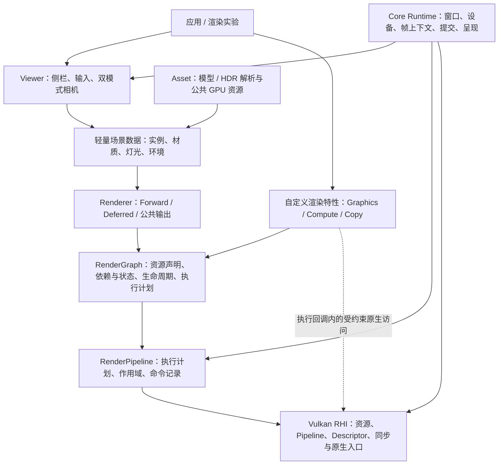
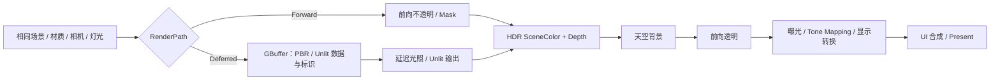

# KuEngine 目标架构与设计边界

更新日期：2026-09-13。本文描述未来演进方向，图中的逻辑模块不等于已经存在的类或 API。需求以 [产品需求](product-requirements.md) 为准，现状以 [当前宏观架构](current-architecture.md) 和 [design](../design/README.md) 为准，实施顺序见 [roadmap](roadmap.md)。

## 1. 一句话原则

用公共 Runtime 处理“程序怎么运行”，用 RenderGraph 处理“资源和 Pass 怎么执行”，用 Renderer 处理“画面怎么组织”，让实验代码专注于“算法怎么算”。

这是职责边界，不要求每个方框拆出一个库、注册系统或继承体系。优先普通 C++ 数据结构、组合和少量明确接口。

## 2. 目标结构

### 所有权与模块边界

| 边界 | 负责 | 不负责 |
|---|---|---|
| Core Runtime | 设备、窗口、帧上下文、Swapchain、提交与退出；为 Graph 导入外部帧资源 | 材质种类、灯光算法、具体 UI 控件 |
| Asset / 公共渲染资源 | 解析与上传、共享 Mesh/Texture、材质 GPU 数据、环境资源的持有与替换 | 每帧 Pass 排序；不把长期资产交给 Graph 自动销毁 |
| 轻量场景数据 | 模型实例及变换、材质引用、相机、灯光、环境状态 | 游戏实体行为、物理、动画框架、ECS |
| Viewer / UI | 选中项、参数编辑、侧栏布局、输入焦点、查看模式 | Vulkan 资源释放、Shader 光照计算 |
| Renderer / Feature | 根据场景构建 Pass，决定前向/延迟算法、Shader 与材质分派 | 重复创建窗口、手动管理通用帧同步 |
| RenderGraph | 描述资源、使用方式、依赖、内部资源生命周期及状态转换计划 | 理解某种 PBR 公式；接管应用所有长期对象 |
| RenderPipeline / RHI | 执行图计划，记录 Graphics/Compute/Copy 命令，提供 Vulkan 能力与诊断 | 生成游戏场景；为尚未使用的扩展建立庞大抽象 |

现有类优先原地演进。当前 `RenderPipeline` 是图执行器，不因为引入 Forward/Deferred 就直接把它改造成承载所有着色逻辑的 Renderer。M2 已将公共 ForwardProgram/ForwardRenderer 与长期 mesh/material/environment 资产落地，Mclaren 保留为示例装配入口；旧 `MclarenRenderResources` 不是运行主路径。M3 已落地 display-ready LDR 的 Graph-owned output；线性 HDR 统一输出、Deferred 和多帧边界仍是未来目标。

## 3. 借鉴 RDG 的部分

UE RDG 通过 Pass 参数表达资源依赖，记录图后再编译执行，并据此处理资源生命周期与同步。KuEngine 借鉴这套声明式组织方式，不承诺复制 UE 的宏、反射、线程模型或全部优化。[参考：Epic RDG 文档](https://dev.epicgames.com/documentation/en-us/unreal-engine/render-dependency-graph-in-unreal-engine)

### 3.1 声明、编译、执行分开

1. 声明：创建图内资源或导入外部资源；添加 Pass，明确读写、用途、Stage/Access/Layout、附件 Load/Store 和子资源范围。
2. 编译：校验引用和依赖，确定执行顺序，推导资源有效期，生成状态转换与附件执行计划。
3. 执行：为本帧取得物理资源，在执行回调中提供受限的资源视图与命令接口，完成提交与结果导出。

简单 Pass 参数结构足够表达依赖，不先建设 Shader 反射体系。静态图可以缓存编译结果；需要变化时重新声明/编译，不能把持久 Pass 对象误当作本帧临时资源的所有者。

### 3.2 资源与同步契约

- 图内 Image/Buffer 描述包含实际分配需要的格式、尺寸/大小、Usage 等信息；Handle 与 Vulkan 物理对象分开。首轮先保证正确分配与复用，不先做内存别名。
- 导入资源声明初始状态、内容是否有效和所有者；导出结果或约定最终状态后，外部使用者才能继续使用。跨帧历史资源通过显式持有/导入/导出连接，不保留过期的帧内 Handle。
- 读写声明区分颜色/深度附件、采样、Storage、Transfer、顶点/索引/Uniform 等用途，覆盖 Image 和 Buffer。首轮以单 Graphics Queue 为主，在该队列能力允许时执行 Compute，不把 Compute 等同于 Async Compute。
- Graph 负责常规跨 Pass 屏障与布局转换；同一 Pass 内算法性同步可以由命令接口表达，但出口状态必须与声明一致。依赖不只来自显式 `dependsOn`，也来自资源读写。
- 生命周期结束不等于 GPU 已经完成。销毁和资源复用必须等待对应提交完成；多帧并行开启前，UBO、Descriptor、Depth、中间资源和 Query 都要按使用寿命隔离。
- 稍后若加入 Pass 裁剪，Present、导出、Readback、外部写入等副作用必须作为保留依据，不能仅凭“没有后继读者”删除执行。

### 3.3 保留 Vulkan 自由度

提供两层使用方式：通常用资源/Pass/Command 封装；实验需要时，在执行回调中取得 Vulkan 原生句柄、命令缓冲与已声明资源。格式、Usage、Shader Stage、Push Constants、设备能力等不强制压缩成跨 API 的最小公约数。

原生入口不意味着绕开 Graph 的事实记录：必须声明相关读写、布局和副作用，不得偷偷提交额外工作或把布局改成执行器不知道的状态。确有图外提交需求时，先定义外部同步与状态交接契约，而不是依赖全局裸句柄。

能力分成引擎基线与可选能力。沿用当前 Vulkan 1.3、Dynamic Rendering 基础，将状态模型落实到 synchronization2；新扩展逐项查询并启用，只在有实际用例时增加封装。能力缺失需要明确提示、跳过该实验或采用明确标注的回退。

## 4. 前向与延迟共用什么

两条路径共用场景输入、Mesh/Texture、材质参数、ShadingModel 语义、灯光/环境、相机以及最终输出处理，区别集中在 Pass 组织与中间资源。

这是目标数据流而非固定调度实现；天空与几何的先后可按深度策略调整。UI 在显示输出之后合成，避免材质曝光改变文字颜色。UI 可以在迁移初期保留当前尾部作用域，最终通过声明式节点或显式外部阶段交接纳入状态契约，不要求第一步重写 ImGui 后端。

PBR 的 Shader 逻辑应尽量共用，避免前向/延迟各自维护一套材质解释。Unlit 是否直接写目标颜色或经 GBuffer 输出由具体设计决定，但外部材质语义必须一致。新增 ShadingModel 时明确其 GBuffer 表达或前向专用限制，不用无限扩大的 GBuffer 预埋所有可能模型。

## 5. 渐进迁移与复杂度约束

- 先在现有 Mclaren 上验证侧栏与相机，再将通用数据与渲染能力抽出；不先重写四个示例。Triangle/Cube/Alpha3Pass 继续作为低层封装与图执行的回归样例。
- 先保留单帧运行，完成单队列、离屏资源和同步闭环，再引入逐帧资源隔离。不能只将 `framesInFlight` 从 1 改成 2。
- 可复用资源按类型和所有权拆分，避免将 `MclarenRenderResources` 简单改名为另一个大容器。
- 不同时引入多后端 RHI、插件框架、完整 ECS、材质节点编辑器、通用反射和任务系统。只有具体特性确实需要时，才扩展相关机制。
- 判断封装是否合适的标准：第二个实验是否能复用；能否解释资源由谁创建和释放；自定义 Vulkan 操作是否仍然可表达。类的数量不是进展指标。

目标架构变更只更新本文；相应实现落地后，才将确定的类、接口与行为写入 design。原有架构图片和历史快照保留，不改画成尚未存在的实现。
