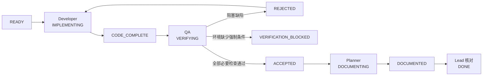

# KuEngine 多智能体协作方式

更新日期：2026-09-13。本文描述开发团队的管理流程，不表示 roadmap 中的功能已经实现。

## 配置与文档分工

| 入口 | 作用 |
|---|---|
| [`.codex/config.toml`](../../.codex/config.toml) | 开启多 Agent、限制并发/深度、注册 Developer、QA、Planner |
| [`.codex/agents`](../../.codex/agents) | 各子 Agent 的运行权限和不可绕过的核心职责 |
| [`AGENTS.md`](../../AGENTS.md) | 所有 Agent 共同遵守的仓库与文档同步规则 |
| [`docs/prompts`](../prompts/README.md) | 可审阅的角色工作方法、交接模板和后续阶段 Prompt |
| [roadmap](roadmap.md) | 阶段目标与验收出口；不用于定义 Agent 权限 |

TOML 决定“有哪些角色以及怎样运行”，`AGENTS.md` 决定“全员必须遵守什么”，普通 Markdown 决定“某阶段和某工作包具体做什么”。主 Agent是当前根会话，不注册为子 Agent。

## 角色与权限

| 角色 | 输入 | 输出 | 版本控制文件写入 |
|---|---|---|---|
| Lead | 用户目标、roadmap、工作区状态 | 任务包、分派、最终交付 | 仅必要的集成与冲突处理 |
| Developer | 单个任务包 | 实现、测试、`CODE_COMPLETE` 交接 | 源码、测试、Shader、构建文件 |
| QA | 冻结实现、验收标准、实现交接 | `ACCEPTED` / `REJECTED` / `VERIFICATION_BLOCKED` | 默认不写；受托时可记录已确认 Bug |
| Planner | 冻结实现、QA 结论、文档映射 | 同步后的设计、状态、日志及 `DOCUMENTED` | 仅文档 |

QA 使用 `workspace-write` 是为了生成构建产物和运行测试，不代表它有权修复代码。行为边界由其 TOML 和 Prompt 同时限定。

## 门禁与单写者规则

共享工作区中，同一时刻只有一个角色修改受版本控制文件。Developer 交接后冻结实现；QA 返回拒绝时写入权才回到 Developer；QA 通过后由 Planner 写文档。真正需要并行实现时，主 Agent先创建不同 Git worktree、分支和构建目录，再明确合并次序。

## 主 Agent 任务包最小内容

每次分派必须包含：任务编号、关联 REQ、目标、前置条件、允许修改范围、明确非目标、验收标准、验证命令、文档影响和交接格式。默认一次只执行一个能够独立验收的工作包。

Agent 遇到网络或会话中断时，先检查 Git 状态、已存在文件和最近交接，再继续未完成步骤。不得从头覆盖工作区，也不得根据残缺的聊天文本推断已经通过验收。

## 完成定义

满足下列条件后，主 Agent才能报告 `DONE`：

- 实现与任务包范围一致，未覆盖无关修改；
- QA 对全部强制验收项给出 `ACCEPTED`；
- design 已与当前代码同步，structure 中的需求和阶段状态有相同证据；
- usage、bugs 和当日日志按实际变化更新；
- 没有把跳过、未运行或环境阻塞的验证写成通过；
- 用户未要求提交/推送时，工作区保持未提交并清楚报告状态。
